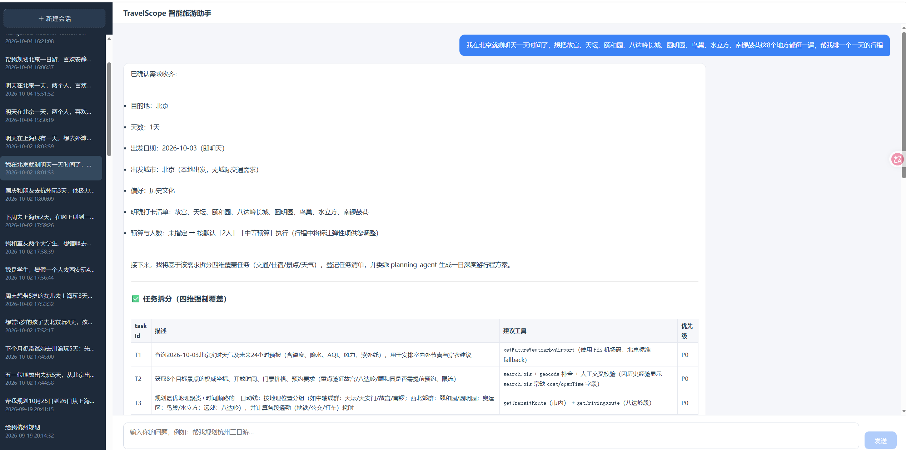
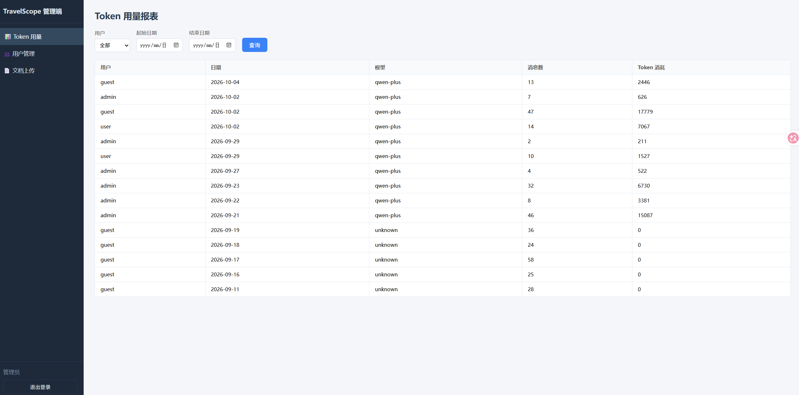
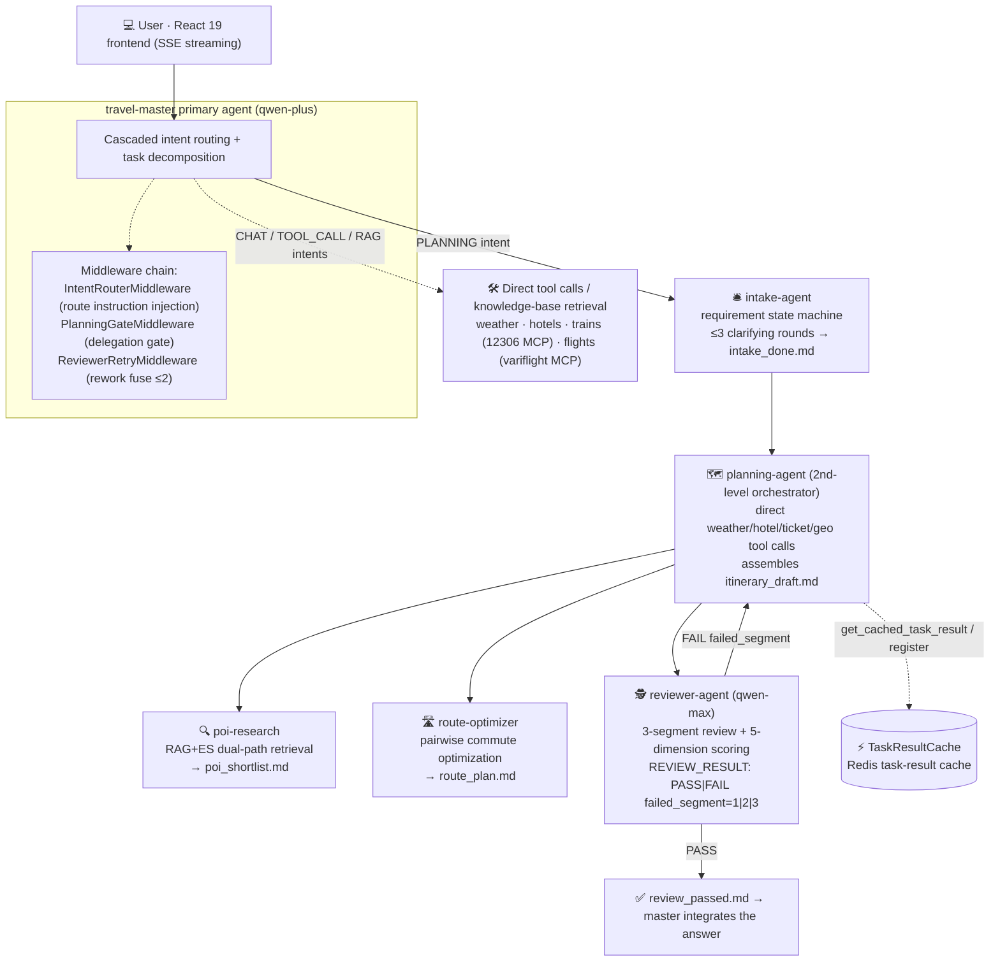

<div align="center">

# 🧭 TravelScope

**An AI multi-agent travel planning system: from a one-sentence request to a ready-to-execute itinerary**

Six-agent orchestration · Segmented review with rework routing · Task-result cache reuse · End-to-end observability

[Java 21](https://img.shields.io/badge/Java-21-orange) · [Spring Boot 3.3](https://img.shields.io/badge/Spring_Boot-3.3.5-brightgreen) · [AgentScope Java 2.0](https://img.shields.io/badge/AgentScope_Java-2.0.3-blue) · [React 19](https://img.shields.io/badge/React-19-61dafb) · [qwen-plus / qwen-max](https://img.shields.io/badge/LLM-qwen--plus%20%2F%20qwen--max-615ced) · [PostgreSQL · Redis · ES](https://img.shields.io/badge/Storage-PG%20%2F%20Redis%20%2F%20ES-336791)

**English** | [简体中文](README.md)

</div>

---

> You say: "**Plan a 2-day Hangzhou + Shanghai trip, budget ¥700, into nature and history**" —
> the intake agent asks clarifying questions to fill in the gaps, the researcher searches POIs
> via dual-path retrieval, the route optimizer iterates pairwise commute times, and the reviewer
> (qwen-max) audits the itinerary in three segments. If a segment fails, **only that segment's
> subtask is redone** — everything else is reused from cache — and the final itinerary, complete
> with timeline, budget breakdown, and alternatives, is streamed to your browser.

## 📸 Screenshots

<p align="center">
  
</p>
<p align="center"><b>💬 Chat</b> — SSE streaming conversation: a live activity stream under each bubble shows sub-task progress (searching POIs / checking weather / quality review), clarifying questions arrive as cards, review scores collapse into a details panel, and the final itinerary renders as Markdown tables</p>

<p align="center">
  
</p>
<p align="center"><b>🛠️ Admin</b> — user management · token usage stats · knowledge document upload</p>

**⚡ At a glance**: **6** agents orchestrated across **3** delegation levels · rework LLM calls measured **↓33%** (best round **↓50%**) · intent routing serves ~**60%** of traffic at **0** LLM cost · **10** EvalCase dual-track quality gates · **40+** test classes

## ✨ Key Features

- 🤖 **Six-agent orchestration** — `travel-master` (intent routing + orchestration) → `intake-agent` (requirement state machine, ≤3 rounds of clarifying questions) → `planning-agent` (second-level orchestrator, calls real-time data tools directly) → the `poi-research` / `route-optimizer` / `reviewer-agent` trio; delegation depth of 3 with code-level gates and fuses
- 🧭 **Three-tier cascaded intent routing** — L0 session continuity (Redis last-intent + short follow-up detection, zero compute) → L1 rule table (~60% of traffic) → L2 qwen-turbo lightweight classification (with result caching) → L3 qwen-plus fallback; upper layers short-circuit on hit
- 🔍 **Dual-path RAG retrieval** — pgvector semantic search + Elasticsearch BM25 keyword search, fused with RRF ranking; results carry `RAG / ES / RAG+ES` provenance tags for poi-research's multi-round re-querying
- ✅ **Segmented review + segment-routed rework (v3.2 flagship)** — a single LLM call audits three segments in order (POI validity / route coherence / budget & preference fit); on failure, only the failed segment's subtask is rerun — **all other results are reused**, full redo is explicitly forbidden
- ⚡ **Task-result cache (FR-S14)** — Redis `taskresult:{userId}:{sessionId}:{taskType}`; POI/route/hotel TTL 30min, weather 10min; rework and re-planning check the cache first, reusing on hit (log anchor `cache_hit=poi`)
- 🛡️ **LLM Gateway** — global concurrency Semaphore(200) → global QPS 100/s → per-user concurrency 2, all via fast-fail `tryAcquire`; the 300s PLANNING slow lane is isolated from the query fast lane, with four levels of user-readable degradation copy pushed straight to SSE on overload
- 📡 **End-to-end observability** — OpenTelemetry instrumentation (chat-turn / task-cache / review-attempt spans and log anchors like `review_retry count=N`) exported to Jaeger; an SSE protocol that separates process from result (`agent_status` activity stream + a dedicated final-answer event)
- 🧪 **Dual-track quality gate** — 10 real-chain EvalCases (multi-city / family / strict budget / nonexistent place / over-dense route); verdicts combine deterministic rule assertions with a qwen-max 3-dimension rubric; any rule FAIL or a total score below 80 fails the gate, with results (including trace_id) persisted to `evaluation_records`

## 🏗️ Architecture



**Review-to-rework routing (the core loop, FR-S08 v3.2 + FR-S14):**

| Failed segment | Audit item | Rework action | Reuse strategy |
|---|---|---|---|
| Segment 1 | POI validity | Rerun only `poi-research` to swap POIs | Route/hotel/weather reused via `get_cached_task_result` |
| Segment 2 | Route coherence + time density | Rerun only `route-optimizer` | POI pool from cache (`cache_hit=poi`); rerunning poi-research is **forbidden** |
| Segment 3 | Budget + preference fit | Planner **re-assembles** / swaps hotels itself | Zero sub-agent reruns; POIs and routes kept as-is |
| Multiple segments | — | Process segments in ascending order | All non-failed results reused |

Rework is capped at 2 rounds; the 3rd review submission is hard-blocked by the `ReviewerRetryMiddleware` fuse (no reliance on model self-discipline), and the loop ends with a "best-effort current version" wrap-up.

**Measured rework cost** (real qwen-plus chain, segment-2 failure, 2 samples per path):

| Path | Elapsed (mean) | LLM calls (mean) |
|---|---|---|
| Full redo (v3.1 semantics, cache cleared) | 275.1 s | 47 |
| **Segment-routed rework (this project)** | **180 s (↓ 35%)** | **31.5 (↓ 33%, best round ↓ 50%)** |

The poi-research branch is eliminated entirely (6 calls → 0) and all four cache types hit; wall-clock savings depend on the weight of the failed segment's subtask (a segment-3 failure, handled purely by the planner, is the best case).

## 🧠 Engineering Judgement: Key Decisions and Trade-offs

| Decision | Why |
|---|---|
| **Prompt-driven with code-level guardrails** | Agent behavior is constrained by SYS_PROMPT contracts, but critical invariants never rely on model discipline: `PlanningGateMiddleware` enforces task-backlog registration before delegation, `ReviewerRetryMiddleware` hard-caps review submissions (log anchor `review_retry count=N`), and hotel budget filtering lives in code for zero hallucination |
| **Tiered model strategy** | Quality-sensitive review runs on qwen-max (routed per sub-agent name via modelResolver — the framework's first name-based resolver), the main chain on qwen-plus, L2 intent classification on qwen-turbo: one model pool, layered by task nature |
| **Intent cascade instead of one big LLM call** | Intent classification is a classification problem, not an agent problem: L0 session continuity costs nothing → L1 rules absorb ~60% of traffic → L2 lightweight model + Redis result cache → L3 fallback; upper layers short-circuit, so classification cost adapts to traffic |
| **Designed for failure** | Redis down → task cache / agent state degrade to in-process memory; RAG unavailable → poi-research falls back to direct AMAP search; lane timeout → user-readable degradation copy pushed to SSE; review verification tools failing → conservative scoring without breaking the flow |
| **Observability as contract** | Log anchors (`cache_hit=poi` / `review_retry count=N` / `cascade_hit=L0..L3`) double as ops grep points and acceptance-test assertions; OTel spans (chat-turn / task-cache / review-attempt) make every rework traceable |
| **Cache and cost coupled** | TTLs tiered by data freshness (weather 10min, POI/route/hotel 30min); rework checks the cache first and reuses on hit, while failed segments rerun and overwrite — explicitly avoiding the trap of reusing a cached result that *is* the failure |

### 🐛 Found by real runs — issues unit tests couldn't catch

Every feature ships with an API_KEY-gated real-chain acceptance test (B1 segmented-review contract / B2 segment-routed rework / B3 cost benchmark). All four issues below were surfaced by real runs, root-caused, then fixed — the most direct argument for measurement-driven development:

| Symptom | Root cause | Fix |
|---|---|---|
| Planner truncated before review submission | `MAX_ITERS=12` couldn't finish the full "first review + rework + re-review" loop (measured 26–30 rounds needed) | Iteration budget recalibrated to 28 from measurement, with the round-by-round breakdown documented in comments |
| Sub-agent conclusion lost forever | `agent_spawn` was passed `timeout_seconds=0`, went async/background; the planner ended its turn with a plain-text "waiting…" message | Sync delegation discipline (explicit 300s) + repeated `wait_async_results` after background promotion + no plain-text turn-ending without a conclusion |
| Final report for a Hangzhou trip was Beijing boilerplate | With all four caches hit, the model took a shortcut and **copied the system-prompt example verbatim** as its final reply | Examples rewritten as placeholder templates + a "complete the loop" rule (cache hits don't exempt the review step) |
| Review report never written to disk | The reviewer burned its 6 iterations on path discovery and was forced to output a verdict before writing review_report.md — the very file the planner's routing depends on | Reviewer budget 6→10 + review task text now includes the draft's full path |

## 🚀 Quick Start

### 1. Requirements

| Dependency | Version | Notes |
|---|---|---|
| JDK | 21+ | |
| Maven | 3.9+ | |
| Node.js | 18+ | Frontend build |
| PostgreSQL | 14+ | Local install with the [pgvector](https://github.com/pgvector/pgvector) extension |
| Docker | — | Orchestrates Redis / MinIO / Elasticsearch |

### 2. Infrastructure & database

```bash
# Redis + MinIO + Elasticsearch (PostgreSQL uses a local instance)
docker-compose up -d

# Create database + extension + schema
psql -U root -d postgres -c "CREATE DATABASE travelscope;"
psql -U root -d travelscope -c "CREATE EXTENSION IF NOT EXISTS vector;"
psql -U root -d travelscope -f src/main/resources/schema.sql
```

### 3. Configure API keys

```bash
cp .env.example .env   # fill in the keys below
```

| Env var | Description | Get it at |
|---|---|---|
| `API_KEY` | Qwen DashScope API key | [console.aliyun.com](https://dashscope.console.aliyun.com/apiKey) |
| `AMAP_WEB_API_KEY` | AMAP (Amap) Web API key | [lbs.amap.com](https://lbs.amap.com/) |
| `WEATHER_API_HOST` | Qweather API host (no https:// prefix) | [dev.qweather.com](https://dev.qweather.com/) |
| `WEATHER_API_KEY` | Qweather API key | [dev.qweather.com](https://dev.qweather.com/) |

> Train/flight lookups go through MCP tools (`mcp__c12306__*` / `mcp__variflight__*`), launched by the framework via npx; the first run downloads the corresponding MCP server.

### 4. Start backend & frontend

```bash
# Backend (default 8080)
mvn spring-boot:run

# Frontend (separate terminal, default 3000, /api → 8080 proxy pre-configured)
cd frontend && npm install && npm run dev
```

Open `http://localhost:3000` to start chatting. Health check: `http://localhost:8080/api/actuator/health`.

## 🧪 Testing & Quality Gates

```bash
# Unit / contract tests (no external API needed, 40+ test classes)
mvn test

# Real-chain acceptance tests (requires export API_KEY=sk-...)
mvn test -Dtest=ReviewerSegmentedReviewRealApiTest      # B1: reviewer segmented-review contract
mvn test -Dtest=PlannerSegmentReworkRealApiTest         # B2: planner segment-routed rework (2 scenarios)
mvn test -Dtest=ReworkCostBenchmarkRealApiTest          # B3: rework cost benchmark

# EvalCase end-to-end quality gate (FR-S15; also needs PG up + EVAL_REAL_API=1)
EVAL_REAL_API=1 mvn test -Dtest=EvalCaseRunnerTest
```

The EvalCase suite lives in `src/test/resources/evalcases/` (EC-001~010), covering multi-city / family trips / strict budgets / nonexistent places / over-dense routes. It runs the full multi-agent chain for real and applies the dual-track verdict; without the env vars set it self-skips and never affects `mvn test`.

## 📁 Project Structure

```
TravelScope/
├── pom.xml                          # Java 21 + Spring Boot 3.3.5 + AgentScope 2.0.3
├── docker-compose.yml               # Redis 7 + MinIO + Elasticsearch
├── .env.example                     # API key template
├── frontend/                        # React 19 + Vite + TS (login / chat / admin)
└── src/
    ├── main/java/com/travelscope/
    │   ├── agent/                   # 6 agents (SYS_PROMPT contracts)
    │   │   ├── ItineraryAgent.java          # planning-agent: segment-routed rework prompt
    │   │   ├── ReviewerAgent.java           # reviewer-agent: 3-segment review contract
    │   │   ├── TravelMasterAgent.java       # travel-master: orchestration & reporting
    │   │   ├── *Middleware.java             # intent routing / delegation gate / rework fuse
    │   │   └── tools/                       # @Tool surface (weather/hotel/transport/RAG/task registry)
    │   ├── service/                 # ChatService / LlmGateway / TaskResultCache / RAG…
    │   ├── controller/  repository/  entity/  dto/  config/  common/
    └── test/java/com/travelscope/
        ├── agent/                   # B1/B2/B3 gated real-chain tests + middleware unit tests
        ├── eval/                    # EvalCase suite + dual-track scoring + runner
        └── ...                      # 40+ test classes (tools/services/gateway/eval)
```

## 📊 Observability

- **Tracing**: Micrometer + OpenTelemetry → Jaeger; business spans: `chat-turn` (whole turn), `task-cache` (cache hit), `review-attempt` (submission count + verdict + score), `task-backlog`, etc.
- **Log anchors** (grep-able and assert-able): `cache_hit={taskType}`, `cache_miss`, `review_retry count=N`, `cascade_hit=L0|L1|L2|L3`, `task_result_registered`
- **SSE event protocol**: `intent` (verdict) → `agent_status` (agent activity stream, rendered live under chat bubbles) → `clarify_question` (question card) → `review_report` (collapsible scoring details) → `done` / `error`

## 🗺️ Roadmap

- [ ] FR-S10 three-tier memory (rolling-summary long-term memory)
- [ ] FR-A admin console: token usage / user management / 3A evaluation dashboard
- [ ] FR-S13 prompter loop (prompt versioning + effect regression)
- [ ] PLANNING slow-lane budget review (full-redo chain measured at 275s, close to the 300s cap)
- [ ] Replace L2 lightweight classification with intent-example vector similarity (pgvector cosine top-1)

## 🧭 Code Navigation

| Want to understand | Read this |
|---|---|
| Six-agent orchestration & model routing | `src/main/java/com/travelscope/config/AgentConfig.java` (buildPlannerAgent: declarative sub-agents + modelResolver) |
| Segment-routed rework contract | `src/main/java/com/travelscope/agent/ItineraryAgent.java` (SYS_PROMPT step 4) |
| 3-segment review & REVIEW_RESULT marker contract | `src/main/java/com/travelscope/agent/ReviewerAgent.java` |
| Rework fuse (≤2 hard cap) | `src/main/java/com/travelscope/agent/ReviewerRetryMiddleware.java` |
| Task-result cache (FR-S14) | `src/main/java/com/travelscope/service/TaskResultCache.java` + `agent/tools/PoiRagTools.java` |
| SSE event protocol & streaming orchestration | `src/main/java/com/travelscope/service/ChatService.java` |
| Three-tier intent cascade | `src/main/java/com/travelscope/agent/IntentCascadeRouter.java` |
| Gated real-chain acceptance tests | `src/test/java/com/travelscope/agent/PlannerSegmentReworkRealApiTest.java`, `ReworkCostBenchmarkRealApiTest.java` |
| EvalCase dual-track quality gate | `src/test/java/com/travelscope/eval/` + `src/test/resources/evalcases/` |

---

<div align="center">

**TravelScope** — a personal learning / portfolio project; code is for study and exchange only

If this project helps you, a ⭐ Star is appreciated

</div>
