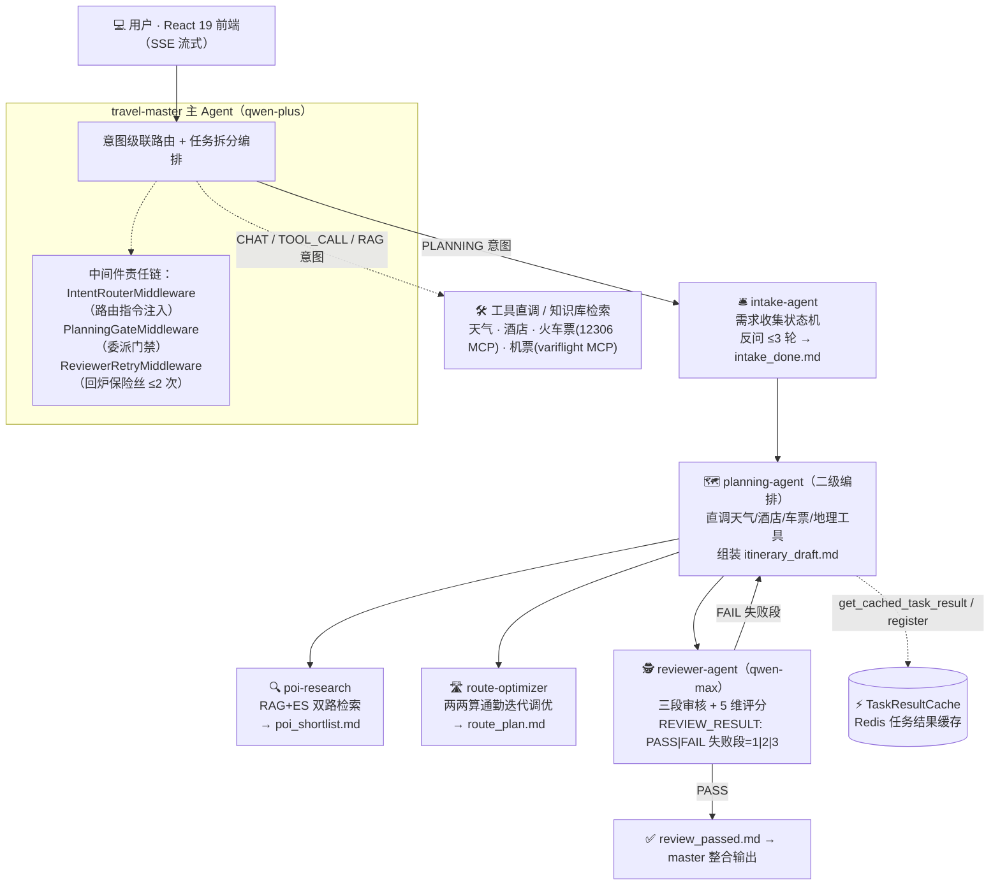

<div align="center">

# 🧭 TravelScope

**从一句话需求到可执行行程单的 AI 多智能体旅行规划系统**

六 Agent 协作编排 · 分段质检回炉 · 任务结果缓存复用 · 全链路可观测

[Java 21](https://img.shields.io/badge/Java-21-orange) · [Spring Boot 3.3](https://img.shields.io/badge/Spring_Boot-3.3.5-brightgreen) · [AgentScope Java 2.0](https://img.shields.io/badge/AgentScope_Java-2.0.3-blue) · [React 19](https://img.shields.io/badge/React-19-61dafb) · [qwen-plus / qwen-max](https://img.shields.io/badge/LLM-qwen--plus%20%2F%20qwen--max-615ced) · [PostgreSQL · Redis · ES](https://img.shields.io/badge/Storage-PG%20%2F%20Redis%20%2F%20ES-336791)

**简体中文** | [English](README.en.md)

</div>

---

> 你说「**帮我规划杭州加上海双城 2 日游，预算 700，喜欢自然和人文**」——
> 需求收集 Agent 会反问补齐关键信息，检索员双路搜景点，排线员两两算通勤迭代调优，
> 质检员（qwen-max）分三段审核行程；哪段不通过就**只回炉那一段**，其余成果走缓存复用，
> 最后把一份带时间线、预算汇总与备选方案行程单流式推到你的浏览器。

## 📸 界面预览

<p align="center">
  
</p>
<p align="center"><b>💬 对话端</b> —— SSE 流式对话：气泡下方的活动流实时展示子任务进展（检索景点 / 查询天气 / 质量审核），需求反问以卡片弹出，质检评分明细折叠展示，最终行程方案以 Markdown 表格渲染</p>

<p align="center">
  
</p>
<p align="center"><b>🛠️ 管理员端</b> —— 用户管理 · Token 用量统计 · 知识文档上传</p>

**⚡ 数据速览**：**6** 个 Agent 深度 3 层编排 · 回炉 LLM 调用实测 **↓33%**（最好一轮 **↓50%**）· 意图路由约 **60%** 流量 0 LLM 成本 · **10** 条 EvalCase 双轨质量门禁 · **40+** 测试类

## ✨ 核心特性

- 🤖 **六 Agent 协作编排** — `travel-master`（意图路由 + 编排）→ `intake-agent`（需求收集状态机，反问 ≤3 轮）→ `planning-agent`（二级编排，直调实时数据工具）→ `poi-research` / `route-optimizer` / `reviewer-agent` 三剑客；编排深度 3 层，委派有代码层门禁与保险丝
- 🧭 **意图三层级联路由** — L0 会话延续（Redis 最近意图 + 短追问识别，0 计算）→ L1 规则表（承接约 60% 流量）→ L2 qwen-turbo 轻量语义分类（带结果缓存）→ L3 qwen-plus 兜底，上层命中即短路
- 🔍 **RAG 双路检索** — pgvector 语义检索 + Elasticsearch BM25 关键词检索，RRF 融合排序，结果带 `RAG / ES / RAG+ES` 来源标记，供 poi-research 多轮换词重查
- ✅ **分段审核 + 按段回炉（v3.2 招牌）** — 一次 LLM 调用内分三段顺序审（POI 有效性 / 路线连贯性 / 预算偏好匹配），不通过时按失败段路由：**只重跑失败的子任务，其余成果一律复用**，严禁全量重做
- ⚡ **任务结果缓存（FR-S14）** — Redis `taskresult:{userId}:{sessionId}:{taskType}`，POI/路线/酒店 30min、天气 10min TTL；回炉与二次规划先查缓存，命中即复用（日志锚点 `cache_hit=poi`）
- 🛡️ **LLM Gateway** — 全局并发 Semaphore(200) → 全局 QPS 100/s → 单用户并发 2，全 `tryAcquire` 快速失败；PLANNING 慢泳道 300s 与查询快泳道隔离，超限四级降级文案直推 SSE
- 📡 **全链路可观测** — OpenTelemetry 埋点（chat-turn / task-cache / review-attempt / review_retry count=N 等 span 与日志锚点）对接 Jaeger；SSE 过程/结果分离事件协议（`agent_status` 活动流 + 最终方案独立事件）
- 🧪 **双轨质量门禁** — 10 条 EvalCase 真实链路用例（多城市/亲子/严格预算/地点不存在/路线过密），「确定性规则断言 + qwen-max Rubric 三维评分」双轨判定，任一 FAIL 或总分 <80 即门禁失败，结果含 trace_id 落库 `evaluation_records`

## 🏗️ 系统架构



**质检回炉路由（核心闭环，FR-S08 v3.2 + FR-S14）：**

| 失败段 | 审核项 | 回炉动作 | 复用方式 |
|---|---|---|---|
| 段 1 | POI 有效性 | 只重跑 `poi-research` 换 POI | 路线/酒店/天气走 `get_cached_task_result` 缓存复用 |
| 段 2 | 路线连贯性+时间密度 | 只重跑 `route-optimizer` 重排 | POI 池缓存复用（`cache_hit=poi`），**严禁**重跑 poi-research |
| 段 3 | 预算+偏好匹配 | planner **自行**重组装/换酒店 | 零子 Agent 重跑，POI 与路线沿用现有成果 |
| 多段失败 | — | 按段号升序逐段处理 | 未失败段成果一律复用 |

回炉 ≤2 次，第 3 次送审被 `ReviewerRetryMiddleware` 代码保险丝硬拦截（不依赖模型自觉），超限以「当前最佳版本（已尽力）」收尾。

**回炉成本实测**（真实 qwen-plus 链路，段2 fail 场景，各 2 轮采样）：

| 路径 | 总耗时（均值） | LLM 调用（均值） |
|---|---|---|
| 全量重做（v3.1 语义，缓存清空） | 275.1 s | 47 |
| **分段回炉（本项目）** | **180 s（↓ 35%）** | **31.5（↓ 33%，最好一轮 ↓ 50%）** |

poi-research 分支被整体省掉（6 次调用 → 0），四类缓存命中；墙钟收益取决于失败段子任务重量（段3 fail 纯 planner 自修订为最优场景）。

## 🧠 工程思维：关键设计与取舍

| 设计决策 | 为什么这么选 |
|---|---|
| **提示词驱动 + 代码层兜底** | Agent 行为靠 SYS_PROMPT 契约约束，但关键不变量绝不依赖模型自觉：委派前 `PlanningGateMiddleware` 强制校验任务清单、回炉次数 `ReviewerRetryMiddleware` 硬拦第 3 次送审（日志锚点 `review_retry count=N`）、酒店按预算过滤放代码层零幻觉 |
| **分级模型策略** | 质量敏感的质检走 qwen-max（经 modelResolver 按子 Agent 名分流，框架首个按名分流的 resolver）、主链路 qwen-plus、L2 意图分类 qwen-turbo——同一模型池按任务性质分层，成本与质量兼得 |
| **意图级联而非一锅 LLM** | 意图识别是分类问题不是 Agent 问题：L0 会话延续 0 计算 → L1 规则表承接约 60% 流量 → L2 轻量模型 + Redis 结果缓存 → L3 兜底，上层命中即短路，分类成本随流量自适应 |
| **面向失败设计** | Redis 挂 → 任务缓存 / Agent 状态自动降级进程内存；RAG 不可用 → poi-research 退化为高德直查；泳道超时 → 用户可读降级文案直推 SSE；评审核验工具失败 → 保守评分不中断流程 |
| **可观测即契约** | 日志锚点（`cache_hit=poi` / `review_retry count=N` / `cascade_hit=L0..L3`）同时是运维 grep 点和验收测试断言点；OTel span（chat-turn / task-cache / review-attempt）让每一次回炉可追溯 |
| **缓存与成本联动** | TTL 按数据时效分级（天气 10min、POI/路线/酒店 30min）；回炉入口先查缓存命中即复用，失败段直接重跑并覆盖登记——显式规避"缓存里存的就是失败结果"的复用陷阱 |

### 🐛 实测驱动：真跑暴露的问题（单测发现不了）

每个特性都配 API_KEY 门控的真实链路验收测试（B1 分段审核契约 / B2 按段回炉路由 / B3 成本基准）。以下四个问题全部由真跑暴露、定位根因后修复——这是"实测驱动开发"最直接的注脚：

| 现象 | 根因 | 修复 |
|---|---|---|
| planner 在送审前被截断 | `MAX_ITERS=12` 跑不完「首审 + 回炉 + 重审」全闭环（实测需 26~30 轮） | 迭代预算按实测校准至 28，注释写明轮次构成 |
| 子 Agent 结论永久丢失 | `agent_spawn` 被传 `timeout_seconds=0` 异步转后台，planner 输出"正在等待…"纯文本即结束回合 | 同步委派纪律（显式 300s）+ 转后台后连续 `wait_async_results` + 禁止无结论纯文本收尾 |
| 杭州行程的最终汇报竟是北京文案 | 四类缓存全命中时模型走捷径，把系统提示词里的示例**原文照抄**当最终回复 | 示例改占位符模板 + 「完整闭环」纪律（缓存命中不豁免送审流程） |
| 质检报告没有落盘 | reviewer 6 轮耗尽在路径探索上，未写 review_report.md 就被迫输出结论——而报告文件正是 planner 按段路由的契约输入 | reviewer 迭代预算 6→10 + 送审任务说明写明草案完整路径 |

## 🚀 快速开始

### 1. 环境要求

| 依赖 | 版本 | 说明 |
|---|---|---|
| JDK | 21+ | |
| Maven | 3.9+ | |
| Node.js | 18+ | 前端构建 |
| PostgreSQL | 14+ | 本地安装，含 [pgvector](https://github.com/pgvector/pgvector) 扩展 |
| Docker | — | 编排 Redis / MinIO / Elasticsearch |

### 2. 启动基础设施与建库

```bash
# Redis + MinIO + Elasticsearch（PostgreSQL 使用本地实例）
docker-compose up -d

# 建库 + 扩展 + 建表
psql -U root -d postgres -c "CREATE DATABASE travelscope;"
psql -U root -d travelscope -c "CREATE EXTENSION IF NOT EXISTS vector;"
psql -U root -d travelscope -f src/main/resources/schema.sql
```

### 3. 配置 API Key

```bash
cp .env.example .env   # 填入下列 Key
```

| 环境变量 | 说明 | 获取地址 |
|---|---|---|
| `API_KEY` | 通义千问 DashScope API Key | [console.aliyun.com](https://dashscope.console.aliyun.com/apiKey) |
| `AMAP_WEB_API_KEY` | 高德地图 Web API Key | [lbs.amap.com](https://lbs.amap.com/) |
| `WEATHER_API_HOST` | 和风天气 API Host（不含 https://） | [dev.qweather.com](https://dev.qweather.com/) |
| `WEATHER_API_KEY` | 和风天气 API Key | [dev.qweather.com](https://dev.qweather.com/) |

> 火车票/机票查询走 MCP 工具（`mcp__c12306__*` / `mcp__variflight__*`），由框架经 npx 拉起，首次运行会下载对应 MCP Server。

### 4. 启动后端与前端

```bash
# 后端（默认 8080）
mvn spring-boot:run

# 前端（另开终端，默认 3000，已配置 /api → 8080 代理）
cd frontend && npm install && npm run dev
```

访问 `http://localhost:3000` 开始对话。健康检查：`http://localhost:8080/api/actuator/health`。

## 🧪 测试与质量门禁

```bash
# 单元 / 契约测试（无需外部 API，40+ 测试类）
mvn test

# 真实链路验收测试（需 export API_KEY=sk-...）
mvn test -Dtest=ReviewerSegmentedReviewRealApiTest      # B1：reviewer 分段审核契约
mvn test -Dtest=PlannerSegmentReworkRealApiTest         # B2：planner 按段回炉路由（两场景）
mvn test -Dtest=ReworkCostBenchmarkRealApiTest          # B3：回炉成本实测基准

# EvalCase 全链路质量门禁（FR-S15，另需 PG 就绪 + EVAL_REAL_API=1）
EVAL_REAL_API=1 mvn test -Dtest=EvalCaseRunnerTest
```

EvalCase 用例库在 `src/test/resources/evalcases/`（EC-001~010），覆盖多城市 / 亲子 / 严格预算 / 地点不存在 / 路路过密五类场景，真实跑完整多智能体链路后按双轨判定；未设置环境变量时自动跳过，不影响 `mvn test`。

## 📁 项目结构

```
TravelScope/
├── pom.xml                          # Java 21 + Spring Boot 3.3.5 + AgentScope 2.0.3
├── docker-compose.yml               # Redis 7 + MinIO + Elasticsearch 编排
├── .env.example                     # API Key 模板
├── frontend/                        # React 19 + Vite + TS（登录 / 聊天 / 管理端）
└── src/
    ├── main/java/com/travelscope/
    │   ├── agent/                   # 6 个 Agent（SYS_PROMPT 契约）
    │   │   ├── ItineraryAgent.java          # planning-agent：按段回炉路由提示词
    │   │   ├── ReviewerAgent.java           # reviewer-agent：三段审核契约
    │   │   ├── TravelMasterAgent.java       # travel-master：编排与汇报
    │   │   ├── *Middleware.java             # 意图路由 / 委派门禁 / 回炉保险丝
    │   │   └── tools/                       # @Tool 工具面（天气/酒店/交通/RAG/任务容器）
    │   ├── service/                 # ChatService / LlmGateway / TaskResultCache / RAG…
    │   ├── controller/  repository/  entity/  dto/  config/  common/
    └── test/java/com/travelscope/
        ├── agent/                   # B1/B2/B3 真实链路门控测试 + 中间件单测
        ├── eval/                    # EvalCase 用例库 + 双轨评分 + Runner
        └── ...                      # 40+ 测试类（工具/服务/网关/评估）
```

## 📊 可观测性

- **Tracing**：Micrometer + OpenTelemetry → Jaeger；业务 span：`chat-turn`（整轮）、`task-cache`（缓存命中）、`review-attempt`（送审计数 + 结论 + 分数）、`task-backlog` 等
- **日志锚点**（可 grep / 可断言）：`cache_hit={taskType}`、`cache_miss`、`review_retry count=N`、`cascade_hit=L0|L1|L2|L3`、`task_result_registered`
- **SSE 事件协议**：`intent`（意图结论）→ `agent_status`（Agent 活动流，前端气泡下方实时渲染）→ `clarify_question`（反问卡片）→ `review_report`（质检评分明细折叠区）→ `done` / `error`

## 🗺️ Roadmap

- [ ] FR-S10 三级记忆分层（滚动摘要长期记忆增强）
- [ ] FR-A 管理端：Token 用量 / 用户管理 / 3A 评估看板
- [ ] FR-S13 Prompter 闭环（提示词版本管理与效果回归）
- [ ] PLANNING 慢泳道预算复核（全量重做链路实测 275s 已逼近 300s 上限）
- [ ] 意图例句向量相似度（pgvector 余弦 top1）替换 L2 轻量分类

## 🧭 核心代码导航

| 想了解 | 看这里 |
|---|---|
| 六 Agent 编排与模型分流 | `src/main/java/com/travelscope/config/AgentConfig.java`（buildPlannerAgent：声明式子 Agent + modelResolver） |
| 按段回炉路由契约 | `src/main/java/com/travelscope/agent/ItineraryAgent.java`（SYS_PROMPT 第 4 步） |
| 三段审核与 REVIEW_RESULT 标记契约 | `src/main/java/com/travelscope/agent/ReviewerAgent.java` |
| 回炉保险丝（≤2 次硬拦截） | `src/main/java/com/travelscope/agent/ReviewerRetryMiddleware.java` |
| 任务结果缓存（FR-S14） | `src/main/java/com/travelscope/service/TaskResultCache.java` + `agent/tools/PoiRagTools.java` |
| SSE 事件协议与流式编排 | `src/main/java/com/travelscope/service/ChatService.java` |
| 意图三层级联路由 | `src/main/java/com/travelscope/agent/IntentCascadeRouter.java` |
| 真实链路验收测试（门控） | `src/test/java/com/travelscope/agent/PlannerSegmentReworkRealApiTest.java`、`ReworkCostBenchmarkRealApiTest.java` |
| EvalCase 双轨质量门禁 | `src/test/java/com/travelscope/eval/` + `src/test/resources/evalcases/` |

---

<div align="center">

**TravelScope** — 个人学习 / 作品集项目，代码仅供学习交流

如果这个项目对你有帮助，欢迎点一个 ⭐ Star

</div>
