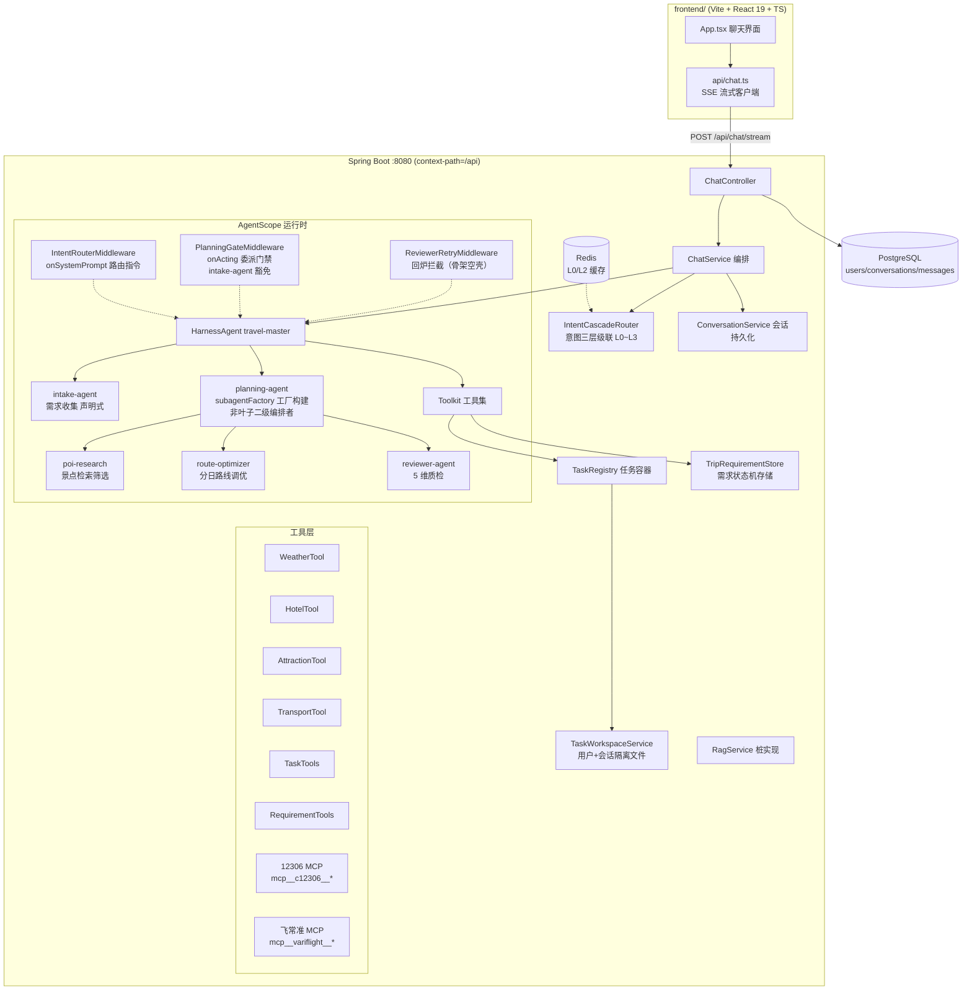

# TravelScope 全模块链路图（含代码实现细节）

> 基于 AgentScope Java 2.0.3 + Spring Boot 3.3.5 + Java 21 + React 19。
> 本文描述每个模块的职责、关键类与代码路径，以及模块间的完整调用链路。
> 2026-09-14 按需求文档 v3 重构为 6 Agent 编排骨架（见第 7 节），工具层原样保留。

## 1. 系统总览



> v3 骨架阶段的状态：6 Agent 编排、需求状态机工具已落地；**意图三层级联（FR-S01）、
> intake-agent 混合形态（FR-S02）、LLM Gateway（FR-S09）、poi-research 双路检索
> （FR-S11）与 TaskResultCache（FR-S14）均已落地并 E2E 验证**；
> SSE 新事件（agent_status / review_score）、Reviewer 回炉拦截为后续迭代（需求文档 v3 §9.2）。

## 2. 前端模块（`frontend/`）

| 文件 | 职责 |
|---|---|
| `src/api/chat.ts` | 手写 SSE 解析器 + 流式请求 + 会话 CRUD |
| `src/App.tsx` | 聊天 UI：会话侧栏、消息气泡、打字机输出、工具状态条、意图标签 |
| `src/types.ts` | `Conversation / ChatMessage / ChatEvent` 类型定义 |

SSE 流式解析核心（`src/api/chat.ts`）：

```ts
async function* parseSse(res: Response) {
  const reader = res.body!.getReader();
  const decoder = new TextDecoder();
  let buf = "";
  while (true) {
    const { done, value } = await reader.read();
    if (done) break;
    buf += decoder.decode(value, { stream: true });
    const parts = buf.split("\n\n");
    buf = parts.pop()!;                       // 最后一段可能不完整，留到下一轮
    for (const part of parts) {
      const event = /^event:\s*(.+)$/m.exec(part)?.[1];
      const data = /^data:\s?([\s\S]*)$/m.exec(part)?.[1] ?? "";
      if (event) yield { event, data };
    }
  }
}
```

dev 代理（`vite.config.ts`）：`'/api' → http://localhost:8080`，与后端 `server.servlet.context-path: /api` 对齐。

## 3. 接入层：ChatController（`controller/ChatController.java`）

| 端点 | 说明 |
|---|---|
| `POST /chat/stream` | SSE 对话（`SseEmitter`，事件见第 9 节） |
| `GET /chat/conversations` | 会话列表（按更新时间倒序） |
| `POST /chat/conversations` | 新建会话 |
| `GET /chat/conversations/{id}/messages` | 历史消息回显 |

```java
@PostMapping(value = "/stream", produces = MediaType.TEXT_EVENT_STREAM_VALUE)
public SseEmitter stream(@Valid @RequestBody ChatRequest req) {
    Conversation conv = conversationService.resolveConversation(req.conversationId());
    return chatService.streamChat(conv, userId, req.message());
}
```

## 4. 编排层：ChatService（`service/ChatService.java`）

一轮对话的完整编排（`streamChat` 方法，含 FR-S09 LLM Gateway 准入）：

```java
public SseEmitter streamChat(Conversation conversation, Long userId, String userMessage) {
    conversationService.saveUserMessage(conversation, userId, userMessage);   // 1. 用户消息入库

    // 2. LLM Gateway 准入（FR-S09）：全局 Semaphore(50) → QPS(10/s) → 单用户 Semaphore(2)
    //    被拒 → SSE error 降级文案（明确提示不白屏），不跑 Agent
    LlmGateway.AcquireResult admission = llmGateway.tryAcquire(String.valueOf(userId));
    if (!admission.allowed()) { emitter.send(error(admission.message())); return emitter; }

    Disposable disposable = Mono
            .fromCallable(() -> resolveIntent(userMessage, userId, conversation.getId()))  // 3. 意图级联（boundedElastic）
            .subscribeOn(Schedulers.boundedElastic())
            .flatMapMany(intent -> Flux.concat(
                    Flux.just(toIntentEvent(intent)),                                // 4. 先推 intent 事件
                    runAgent(conversation, userId, userMessage, intent, replyBuf))   // 5. 跑主 Agent 事件流
                    // 快慢泳道线程池隔离（FR-S09）：按意图调度到 fast-lane/slow-lane 专用池——
                    // PLANNING 的同步 spawn 长阻塞只占慢池，查询在快池独立执行互不拖拽
                    .subscribeOn(intent.toIntentType() == PLANNING ? slowLaneScheduler : fastLaneScheduler))
            .subscribe(event -> sendEvent(emitter, event),
                    error -> handleError(...),                                       // 6. 释放网关槽位 + SSE error
                    () -> handleComplete(...));                                      // 7. done 时释放槽位 + 入库
    ...
}
```

`runAgent` 尾部的泳道超时：`.timeout(gateway.laneTimeout(isPlanning))`——PLANNING 60s /
其余 25s（实测校准：master 含工具调用的多轮推理链在 qwen-plus 慢响应下 5s/15s 会误杀），
超时 → SSE error「处理超时了（N 秒上限），请稍后重试或换个问法～」。
Agent 层异常经 `sseFallbackMessage` 映射降级文案（熔断 OPEN →「模型服务暂时不可用
（已触发熔断保护）…」；认证类 →「模型服务认证异常…」）。

意图路由与上下文注入（`runAgent`）——**用户+会话隔离的关键接线**：

```java
RuntimeContext ctx = RuntimeContext.builder()
        .userId(String.valueOf(userId))
        .sessionId(SESSION_PREFIX + conversation.getId())   // "conv-13"
        .build();
ctx.put(IntentRouterMiddleware.CTX_INTENT_KEY, type.name());
// 协作目录相对路径（tasks/{sessionId}）注入上下文，Middleware 据此给出具体路径；
// 该键同时是 intake-agent 侧工具解析主会话 ID 的来源（子代理 ctx.sessionId 是 sub-xxx，见 6.4 节）
ctx.put(IntentRouterMiddleware.CTX_COLLAB_DIR_KEY,
        taskWorkspaceService.collabDirRelativePath(agentSessionId));

// v3 FR-S02 代码层兜底：PLANNING 且需求未收齐时，向用户消息前置「立即委派 intake-agent」
// 系统指令——master 对提示词的委派遵循性有波动（实测约 50% 轮次只回文本），应用层注入是硬保证
if (type == IntentType.PLANNING && !tripRequirementStore.isCollected(userId, agentSessionId)) {
    outgoing = "【系统指令】需求收集尚未完成，请立即调用 agent_spawn 委派 intake-agent…\n\n【用户消息】" + outgoing;
}

UserMessage msg = new UserMessage(outgoing);
return travelMasterAgent.streamEvents(msg, ctx)          // Reactor 事件流
        .filter(event -> isMainAgentEvent(event) || isClarifyEvent(event))  // 主 Agent 事件 + intake 反问（6.4 节）
        .mapNotNull(this::toChatEvent);                  // AgentEvent → SSE 事件映射
```

事件映射：`TextBlockDeltaEvent → delta`、`ToolCallStartEvent / ToolResultEndEvent → tool`、
intake 反问的 `ToolResultTextDeltaEvent → clarify_question`（见 6.4 节）、`AgentEndEvent → null`
（结束在流完成回调统一处理）。

## 5. 意图分类与路由（FR-S01 三层级联，已落地）

**IntentCascadeRouter**（`agent/IntentCascadeRouter.java`）：意图识别的统一入口，
ChatService.resolveIntent 每轮调用。四层级联，**上层命中即短路返回**：

```
用户消息
   │
   ▼
L0 会话延续   短追问（≤20 字符且含代词/语气词/延续词，正则 FOLLOWUP_HINT）
              + Redis 有 30 分钟内该会话最近意图（travelscope:intent:l0:{userId}:{sessionId}）
              → 沿用上次意图，0 计算，命中刷新 TTL
   │ 未命中
   ▼
L1 规则表     保守正则集（打招呼/命令前缀/极固定句式），首个命中即返回，0 模型调用
              （yml travelscope.intent-cascade.l1-rules 可配置，未配置时代码内置同款默认）
              刻意不收编规划类自然语言（「帮我规划杭州三日游」负向回归用例固定守护）
   │ 未命中
   ▼
L2 轻量语义   qwen-turbo 单标签分类（LightweightIntentClassifier，15s 超时）
              + Redis 文本缓存（travelscope:intent:l2:{sha256(msg)}，60 分钟 TTL）
   │ 仍未命中（null/非法标签/超时）
   ▼
L3 LLM 兜底   现有 IntentClassifier（qwen-plus + JSON Schema）原样包装——
              AgentConfig 以方法引用 intentClassifier::classify 注入，零改动
```

关键实现细节：

- **L2 双路径解析**：qwen-turbo 对框架结构化输出（metadata `_structured_output` 键）
  遵循度不稳定，实测常把标签（如 `CHAT`）直接当纯文本输出——LightweightIntentClassifier
  先走结构化解析，异常/为空再走纯文本标签归一化（去引号句读后 valueOf），
  双路皆失败才返回 null 落 L3
- **Redis 降级**：RedisIntentCache 每个操作 try/catch 全异常（首次 warn 后续 debug），
  Router 侧另有 safe* 防御包装——缓存彻底不可用时级联自动退化为 L1 → L2 → L3，不阻断对话
- **每层命中写回 L0**：任何一层成功都刷新该会话最近意图（TTL 滚动），支撑后续追问走 L0
- **埋点日志**（FR-S12 基础）：`cascade_hit=L0|L1|L2|L2_CACHE|L3 latency={x}ms intent={} userId={} sessionId={}`，
  全层未命中输出 `cascade_miss`
- **配置**（`travelscope.intent-cascade.*`）：`enabled`（false 直通 L3 保持旧行为）、
  `l0-enabled / l0-ttl-minutes / l0-max-message-length`、`l2-enabled / l2-model /
  l2-cache-enabled / l2-cache-ttl-minutes`、`l1-rules`（List，仓库首个 List 配置）
- **Bean 装配**（AgentConfig）：`dashscopeChatModel`（qwen-plus，@Primary）+
  `dashscopeTurboModel`（qwen-turbo，L2 专用）+ `intentCascadeRouter`（L2=turbo 包装、
  L3=intentClassifier 方法引用）

实测数据（真实 API，验收标准对照）：「你好」/「/天气 北京」L1 命中 0ms 且零模型调用；
「帮我规划杭州三日游」L2 命中 270ms 判 PLANNING；同会话追问「那改成四天呢」L0 命中 0ms。
测试：`IntentCascadeRouterTest`（16 用例含 a~e 全映射）、`LightweightIntentClassifierTest`
与 `IntentCascadeRealApiTest`（API_KEY 门控）、`RedisIntentCacheTest`（6379 端口门控）。

**IntentRouterMiddleware**（`agent/IntentRouterMiddleware.java`）：`onSystemPrompt` 阶段按意图追加路由指令。
PLANNING 指令会注入本轮会话的具体协作路径（来自 `CTX_COLLAB_DIR_KEY`）：

```
【本轮路由指令】系统已判定本轮为完整行程规划意图。本轮会话: conv-13, 协作目录: tasks/conv-13（相对工作区根）。

委派流程（系统在代码层强制校验，跳步会被拦截）：
1. 委派 intake-agent 收口需求：任务说明中带上本轮用户消息与协作目录 tasks/conv-13。
   - intake-agent 返回反问 → 原样转达给用户，本轮结束
   - intake-agent 返回「信息已收齐」→ 读取 tasks/conv-13/intake_done.md，继续第 2 步
2. 按需求拆分任务（每项含 taskId/描述/建议工具/优先级）
3. 调用 create_task_backlog 工具登记清单：sessionId 填 "conv-13", tasksJson 填任务 JSON 数组…
4. 登记成功后调用 agent_spawn 委派 planning-agent，任务说明中必须写明：
   「用 read_file 读取 tasks/conv-13/task_backlog.md 与 intake_done.md 执行；每完成一项任务调用 update_task_status 回报」
5. 需要时调用 get_task_progress 查询未完成任务数…完成后整合 execution_result.md、itinerary_draft.md 与 review_passed.md 输出
```

## 6. 任务容器与需求状态机（需求 1 + 2 核心）

### 6.1 TaskRegistry（`service/TaskRegistry.java`）

内存容器 + MD 文件双份存储，按 `userId:sessionId` 双键隔离；登记时做**四维覆盖校验**（FR-S03）：

```java
public String createBacklog(String userId, String sessionId, String tasksJson) {
    List<PlanningTask> parsed = parseTasks(tasksJson);          // fastjson2 解析 JSON 数组
    if (parsed.isEmpty()) return "ERROR: tasksJson 无法解析…";   // 代码层校验
    List<String> missing = missingDimensions(parsed);           // 四维校验：交通/住宿/景点/天气
    if (!missing.isEmpty())                                     // 缺维 → 报错重拆，不落盘不注册
        return "ERROR: 任务清单缺少维度：" + … + dimensionHints(missing);
    String md = renderBacklogMd(sessionId, parsed);
    Path file = taskWorkspaceService.writeTaskBacklog(userId, sessionId, md);  // 落盘（隔离路径）
    containers.put(containerKey(userId, sessionId),
            new SessionTaskContainer(userId, sessionId, file, parsed));        // 注册内存队列
    return "任务清单已登记：共 N 项…现在可以调用 agent_spawn 委派 planning-agent…";
}
```

四维维度映射（`DIMENSION_RULES`，双路匹配）：**suggestedTool 前缀/精确**（train-ticket-query /
flight-ticket-query / mcp__c12306* / mcp__variflight* → 交通；hotel-search → 住宿；
attraction-search → 景点；weather-query → 天气）**+ description 关键词兜底**（火车/酒店/景点/天气等），
任一命中即视为该维覆盖。缺维返回 ERROR（附建议技能名）引导 master 补拆重登——与
PlanningGateMiddleware 的 GATE_REJECTED 纠错循环同款模式。测试：`TaskRegistryDimensionTest`。

- `progress(userId, sessionId)` → 「共 N 项：已完成 x，进行中 y，待处理 z，失败 f。未完成任务: T2(PENDING)…」
- `updateStatus(userId, sessionId, taskId, status)` → 状态机 PENDING/IN_PROGRESS/DONE/FAILED，同时追加写 MD 文件
- `hasBacklog(userId, sessionId)` → 委派门禁校验用

### 6.2 TaskTools（`agent/tools/TaskTools.java`）

注册进 Toolkit，主/子 Agent 都能调用的 3 个业务工具 + 1 个门禁提示工具：

```java
@Tool(description = "登记行程规划任务清单到任务容器…")
public String create_task_backlog(
        @ToolParam(name = "sessionId", description = "本轮会话 ID…") String sessionId,
        @ToolParam(name = "tasksJson", description = "任务清单 JSON 数组字符串…") String tasksJson,
        RuntimeContext ctx) {                       // 不带 @ToolParam 的参数 = Toolkit 自动注入上下文
    return taskRegistry.createBacklog(ctx.getUserId(), sessionId, tasksJson);
}
```

> 上下文注入机制：`ToolMethodInvoker.convertParameters` 对**未标注 @ToolParam 且类型为 RuntimeContext**
> 的参数直接传入当前调用的 RuntimeContext——userId 因此不依赖 ThreadLocal，子代理调用时自然带自己的上下文。

### 6.3 PlanningGateMiddleware（`agent/PlanningGateMiddleware.java`）

**代码层强制「先登记清单、再委派」**——在 `onActing` 阶段拦截并重写工具调用。
v3 起增加 **intake-agent 豁免**：需求收集发生在任务登记之前（需求文档 4.2 步骤 [5]/[6]），
`agent_id=intake-agent` 的 spawn 不受门禁约束：

```java
// 读意图：RuntimeContext.get(String) 签名是 <T> T get(String)，必须直接以 String 接收。
// 勿写 String.valueOf(ctx.get(...))——泛型目标类型推断会把 <T> 定为 char[]，
// 绑定 String.valueOf(char[]) 重载，运行时 String→char[] 强转抛 ClassCastException
// （2026-09-16 真实规划请求触发过，详见 fix-record 7.6 节）
String intent = ctx.get(IntentRouterMiddleware.CTX_INTENT_KEY);

public Flux<AgentEvent> onActing(Agent agent, RuntimeContext ctx, ActingInput input,
                                 Function<ActingInput, Flux<AgentEvent>> next) {
    // 仅 PLANNING 意图 + 出现 agent_spawn 时介入
    if (spawns.isEmpty() || !"PLANNING".equals(intent)) return next.apply(input);

    // intake-agent 豁免：需求收集是任务登记的前置步骤，不受门禁约束
    boolean hasGatedSpawn = spawns.stream()
            .anyMatch(t -> !IntakeAgent.AGENT_NAME.equals(agentIdOf(t)));   // 读 spawn 参数 agent_id
    if (!hasGatedSpawn) return next.apply(input);

    if (taskRegistry.hasBacklog(userId, sessionId)) return next.apply(input);  // 已登记 → 放行

    // 未登记 → 把受门禁约束的 agent_spawn 调用【替换】为 planning_gate_hint（真实工具，返回纠正指令）
    // （intake-agent 的 spawn 即使与受门禁的 spawn 同轮出现也原样保留）
    List<ToolUseBlock> rewritten = new ArrayList<>();
    for (ToolUseBlock call : input.toolCalls()) {
        rewritten.add("agent_spawn".equals(call.getName()) && !IntakeAgent.AGENT_NAME.equals(agentIdOf(call))
                ? new ToolUseBlock(call.getId(), GATE_HINT_TOOL, Map.of("reason", hint))
                : call);
    }
    return next.apply(new ActingInput(rewritten));   // 受门禁的 agent_spawn 根本不会执行
}
```

`order() = -1000`：`MiddlewareChain.build` 按列表顺序嵌套、第一个为最外层，harness 的
`SubagentsMiddleware`（order=1，直接执行 agent_spawn）必须排在其后，拦截才生效。

### 6.4 需求状态机（v3 FR-S02：intake-agent 的代码工具，已落地）

「判断缺什么」是纯确定性逻辑，下沉为代码工具（`agent/tools/RequirementTools.java`），
「怎么问、怎么听」由 intake-agent 的语言能力承载：

```java
@Tool(description = "查询当前会话行程需求的收集状态：已收集哪些字段、还缺哪些必填项…")
public String get_missing_fields(@ToolParam(name = "sessionId") String sessionId, RuntimeContext ctx) {
    return store.get(ctx.getUserId(), sessionId).summary();      // missingFields() 纯字段判空，零模型调用
}

@Tool(description = "把本轮理解到的需求字段写回状态机。fieldsJson 形如 {\"destination\":\"北京\",…}")
public String update_requirement_state(…) { … store.save(userId, sessionId, s); }  // Redis 副本须显式写回

@Tool(description = "向用户发出一轮反问（intake-agent 唯一反问出口）…")
public String ask_user(@ToolParam(name = "question") String question, …, RuntimeContext ctx) {
    TripRequirementState s = store.incrementClarifyCycles(userId, sessionId);   // 轮次+1，满3轮置 DEGRADED
    return question + ";;[intake]反问已发送（第 n/3 轮）…";     // ;; 前段经 SSE 转 clarify_question
}
```

- `dto/TripRequirementState`：8 字段（必填 destination/days/startDate/fromCity + 选填
  budget/preference/people/special）+ 状态枚举 COLLECTING/DONE/DEGRADED + 反问轮次计数
- `service/TripRequirementStore`：**Redis hash `trip:req:{userId}:{sessionId}`**（hash 字段即
  状态字段，TTL 24h 滚动刷新，运维可 HGETALL 直接观察收集进度）；Redis 异常时降级进程内存
  （首次 warn 后续 debug）。注意 Redis 模式下 get 返回副本，修改后必须 save 写回
- **sessionId 解析**（`resolveSessionId`）：工具参数为 conv- 前缀则信任；否则从 ctx 的
  `travelscope.collab.dir`（master 注入、子代理经 RuntimeContext 继承）解析——
  intake-agent 被 spawn 后自身 ctx.sessionId 是框架生成的 sub-xxx，不能作状态键
- **反问链路**（clarify_question SSE 事件）：intake 的 ask_user 工具结果文本
  （`ToolResultTextDeltaEvent`，source 形如 `conv-xx/intake-agent`）被 ChatService 拦截，
  截取 `;;` 前的反问推送。两个硬前提由代码保证：①PlanningGateMiddleware 把 intake 的
  异步 spawn（timeout_seconds=0）强制改写为同步——异步模式下子代理事件不进本会话流；
  ②ChatService 在 PLANNING 且需求未收齐时向用户消息前置「立即委派 intake」系统指令——
  master 对提示词的委派遵循性有波动（实测约 50% 轮次只回文本），应用层注入是硬保证
- **收尾闭环**：必填收齐 → DONE 写 intake_done.md；反问满 3 轮仍缺 → DEGRADED 带默认值
  放行（缺项标「待确认」），DEGRADED 一旦置位不回退
- 测试：`RequirementToolsTest`（7 用例，ThrowingRedisTemplate 驱动内存降级路径）、
  `TripRequirementStoreRedisTest`（6 用例，6379 门控，HGETALL 断言 hash 结构/TTL/DEGRADED 持久化）

## 7. Agent 层（`config/AgentConfig.java` + `agent/`）

v3 编排为 6 Agent：master 收口 → intake 收需求 → Planner 直调工具 + 并行调度 → Reviewer 质检。
**关键框架事实**（agentscope-harness 2.0.3 字节码核验）：声明式 `SubagentDeclaration` 注册的
子 Agent 被框架强制 `asLeafSubagent()`——toolkit 无 `agent_spawn`，不能再委派。因此：

- **intake-agent** 走声明式（叶子即可）：`.subagent(intakeSubAgent)`，tools 白名单限定状态机工具
- **planning-agent** 走 **`subagentFactory(name, description, factory)` 公开 API**：工厂内用
  `HarnessAgent.builder()` 手工构建（非叶子），build 时自动安装 SubagentsMiddleware，
  能 spawn 自己声明的 3 个子 Agent；spawn 深度 master(0)→planner(1)→子(2) ≤ 框架上限 3

```java
// intake-agent：声明式叶子，tools 白名单限定需求状态机工具（含 ask_user 反问出口）
SubagentDeclaration intakeSubAgent = SubagentDeclaration.builder()
        .name(IntakeAgent.AGENT_NAME)
        .description("需求收集 Agent（接待员）…")
        .inlineAgentsBody(IntakeAgent.SYS_PROMPT)
        .model(appProperties.getDashscope().getModel())
        .maxIters(IntakeAgent.MAX_ITERS)               // 6
        .workspaceMode(WorkspaceMode.SHARED)
        .tools(List.of("get_missing_fields", "update_requirement_state", "ask_user"))
        .build();

HarnessAgent agent = HarnessAgent.builder()
        .name("travel-master").sysPrompt(TravelMasterAgent.SYS_PROMPT)
        .model(dashscopeChatModel).modelResolver(name -> dashscopeChatModel)
        .toolkit(toolkit).maxIters(15)
        .middlewares(List.of(new IntentRouterMiddleware(),
                new PlanningGateMiddleware(taskRegistry),
                new ReviewerRetryMiddleware()))         // v3 骨架空壳透传，order=-900
        .permissionContext(PermissionContextState.builder().mode(PermissionMode.BYPASS).build())
        .workspace(".agentscope/workspace")
        .skillRepository(new ClasspathSkillRepository("skills"))
        .stateStore(new InMemoryAgentStateStore())
        .subagent(intakeSubAgent)
        // planning-agent：工厂手工构建非叶子二级编排者
        .subagentFactory(ItineraryAgent.AGENT_NAME, "规划 Agent（二级编排者）…",
                name -> buildPlannerAgent(toolkit, dashscopeChatModel))
        .build();
```

`buildPlannerAgent(toolkit, model)`（同文件私有方法）内部——三个声明均 SHARED 工作区，
poi-research 限定 attraction-search 技能：

```java
SubagentDeclaration poiResearch = SubagentDeclaration.builder()
        .name("poi-research").inlineAgentsBody(PoiResearchAgent.SYS_PROMPT)
        .maxIters(6).workspaceMode(WorkspaceMode.SHARED)
        .skills(List.of("attraction-search")).build();
SubagentDeclaration routeOptimizer = …("route-optimizer", maxIters=6, SHARED)…;
SubagentDeclaration reviewer       = …("reviewer-agent",  maxIters=6, SHARED)…;

return HarnessAgent.builder()
        .name("planning-agent").sysPrompt(ItineraryAgent.SYS_PROMPT)
        .model(dashscopeChatModel).modelResolver(name -> dashscopeChatModel)
        .toolkit(toolkit).maxIters(12)                  // v3: 8 → 12（直调+spawn+组装+送审链路长）
        .permissionContext(…BYPASS…).workspace(".agentscope/workspace")
        .skillRepository(new ClasspathSkillRepository("skills"))
        .stateStore(new InMemoryAgentStateStore())
        .subagents(List.of(poiResearch, routeOptimizer, reviewer))
        .build();
```

> 工厂细节：`subagentFactory` 的 `Function<String,Agent>` 每次 spawn 调用时 build 新实例
> （与 IntentClassifier 每次新建 ReActAgent 同款模式）；传入共享 toolkit 引用是安全的——
> `HarnessAgent.build()` 内部对 toolkit 做 copy（浅拷贝共享工具实例），不污染 travelToolkit Bean，
> MCP npx 进程不会重复拉起。`ClasspathSkillRepository` 构造抛 IOException，工厂内捕获转为
> 非受检异常（Function 不允许抛受检异常）。

提示词结构（6 个常量类中的 `SYS_PROMPT` text block，格式一致）：

- `TravelMasterAgent`：IMPORTANT 硬约束 → 能力与路由（For X, use Y + 不得委派反向清单）→
  简单请求流程 → 规划流程（**委派 intake 收口 → create_task_backlog 登记 → agent_spawn 委派
  Planner → 整合 review_passed.md**）→ 任务容器协作机制 → 输出风格
- `IntakeAgent`：工作流程（理解→update 写回→查缺项→二选一收尾）→ 反问策略（选择题/默认值/
  ≤3 轮 DEGRADED）→ 工具 → intake_done.md 格式 → 约束（状态机是唯一事实源）
- `ItineraryAgent`（v3 Planner）：Scope（直调工具 + 只委派 poi/route）→ 输入（backlog +
  intake_done）→ 执行流程（①直调工具 ②同回合并行 spawn ③组装 + POI 坐标核验 ④spawn reviewer
  送审，不通过回炉 ≤2 次）→ 执行规范 → 汇报格式
- `PoiResearchAgent`：多轮换词重查 → poi_shortlist.md（RAG 双路 TODO 待 FR-S11）
- `RouteOptimizerAgent`（FR-S07 已落地）：读 poi_shortlist（坐标 `经度,纬度` 直接作工具入参）
  → 两两调 getTransitRoute/getDrivingRoute（duration 秒/distance 米，写前换算分钟）
  → 就近聚类分日（硬性禁折返）+ 开放时间排序 → 迭代检验调整（route_plan.md「调优过程」
  小节留痕）→ **收尾自登记** register_task_result(route)（登记职责在产出者，不依赖 planner
  代登——poi 落地时 planner 代登实测翻车，见 fix-record 7.10/7.11）；声明挂 tools 白名单
  + route-planning 技能（路线工具手册：单位换算/两两策略）。已知行为特征：qwen-plus
  在长计算后倾向文本收尾跳过写文件——有效手段是「先写初版再修订」顺序（7.11 节发现②）
- `ReviewerAgent`（FR-S08 已落地，**qwen-max 评分模型**——planner 的 modelResolver 按
  agent name 分流，首个按子 Agent 分流的 resolver）：5 维评分（各 20 分，总分 ≥80 且
  无单维 <12 通过；最终回复首行输出机器标记 `REVIEW_RESULT: PASS|FAIL 总分=xx`）→
  至少核验 1 项事实声明（真实调 getTransitRoute/getWeather 重算，核验记录写入报告）→
  通过写 review_passed.md + 自登记缓存（review_passed 随 itinerary 类目）；不通过写
  review_report.md（5 维三列表 + 核验记录 + 改进建议）。**回炉闭环**：planner 提示词
  驱动（读建议→修订→重送 ≤2 次→超限「⚠️ 已尽力」收尾）；`ReviewerRetryMiddleware`
  代码保险丝（第 4+ 次 spawn reviewer 改写为 review_retry_hint，杜绝无限循环；
  review_passed.md 出现即重置计数；日志锚点 `review_retry count=N`）——框架无改写
  文本回复钩子的实测替代方案（fix-record 7.12）。慢泳道 300s 承载全链

### 7.1 LLM Gateway（FR-S09，已落地：限流/熔断/快慢泳道/降级）

两层职责解耦，各自可测：

**对话准入层 `service/LlmGateway`**（ChatService 调用，纯 Java + R4j RateLimiter）：

- 全局 `Semaphore(50)` → 全局 QPS（R4j 滑动窗口 10/s）→ 单用户 `Semaphore(2)`（当前
  无认证体系，guest 即全站上限），全部 `tryAcquire`（等待 2s），被拒返回用户可读文案
  → SSE error（不白屏）：GLOBAL_BUSY「当前使用人数较多…」/ QPS_LIMIT「请求过于频繁…」/
  USER_BUSY「您的上一条请求还在处理中…」
- 失败路径按获取逆序回滚信号量（QPS 拒绝不泄漏全局槽位）；对话结束（done/error）release
- **快慢泳道线程池隔离**：ChatService 持有两个 `Schedulers.newBoundedElastic` 专用池
  （fast-lane / slow-lane 各 10 线程），按意图把整条对话链调度到对应池——PLANNING 的
  同步 spawn 长阻塞只占慢池，查询类在快池独立执行互不拖拽；叠加对话级超时
  （PLANNING 300s——完整质检链含 reviewer 评分与 ≤2 次回炉，实测单段 30-60s；
  其余 25s，实测校准）

**模型调用层 `agent/LlmGatewayModel`**（`implements Model` 装饰器，AgentConfig 包装主模型 Bean）：

```java
Flux<ChatResponse> guardedPrimary = Flux.defer(() -> activeModel.get().stream(...))
        .transformDeferred(CircuitBreakerOperator.of(circuitBreaker))  // 熔断统计挂主模型流
        .timeout(callTimeout);                                          // 单次调用 30s
return guardedPrimary.onErrorResume(e -> {
    log.warn("fallback → qwen-turbo …");                                // 检测标准 3 的日志锚点
    activeModel.set(fallback);
    return fallback.stream(...);                                        // 中途失败也切（强于原生）
});
```

- master/planner/modelResolver/4 个声明式子 Agent/意图级联 L3 全部收敛到装饰后的主模型
  Bean——包一个实例全链路生效；turbo Bean 保持裸实例（L2 + fallback 目标，降级终点不套熔断）
- 熔断参数：窗口 10 次 / 失败率 50% / 最小样本 5 / OPEN 10s → HALF_OPEN 惰性转换
  （纯等待不转状态，下一次调用的 permission 检查触发）
- 状态变迁埋点：`circuit_breaker CLOSED → OPEN / OPEN → HALF_OPEN` 日志

**框架核验结论**（反编译 agentscope 2.0.3，落地依据）：Model 仅 2 抽象方法+3 default，
框架自己的 fallbackModel 实现就是同款 `implements Model` 包装器（ReActAgent$2）；
`ChatModelBase.stream` 是 public final（不能继承装饰）；**DashScopeHttpException（401/
invalid model）不实现 ModelHttpException——框架原生重试不认它**，自建 R4j 层是唯一处理点；
`GenerateOptions.modelName` 被 DashScopeChatModel 忽略——fallback 必须持有独立 turbo 实例。

**设计取舍**：未用框架原生 `fallbackModel`/`maxRetries`（原生只在首个信号错误时切换、
且与本装饰器叠加会双层重试）；fallback 采用粘滞切换（切到 turbo 后本进程不自动回 plus，
重启恢复）——避免主模型恢复瞬间反复抖动。

测试：`LlmGatewayTest`（7 用例：单用户/全局/QPS/release/回滚/泳道取值/开关）、
`LlmGatewayModelTest`（5 用例：fallback/中途失败/双失败上抛/熔断 OPEN+HALF_OPEN/能力委托）、
`LlmGatewayRealApiTest`（API_KEY 门控：正常路径 + 错 Key 401→fallback→turbo 真实链路）。

## 8. 工作区与隔离结构（需求 1）

```
.agentscope/workspace/                     ← harness workspace 根
└── {userId}/                              ← harness 按 RuntimeContext.userId 自动隔离（用户级）
    ├── MEMORY.md / memory/                ← Agent 长期记忆（每用户独立）
    ├── tasks/
    │   └── {sessionId}/                   ← 会话协作目录（会话级）
    │       ├── intake_done.md             ← intake-agent 写入的需求收集结果（v3 新增）
    │       ├── task_backlog.md            ← create_task_backlog 落盘的任务清单
    │       ├── poi_shortlist.md           ← poi-research 产出的景点候选清单（v3 新增）
    │       ├── route_plan.md              ← route-optimizer 产出的分日路线方案（v3 新增）
    │       ├── execution_result.md        ← 规划 Agent 写回的执行结果
    │       ├── itinerary_draft.md         ← 规划 Agent 生成的行程草案
    │       ├── review_report.md           ← reviewer-agent 不通过时的质检报告（v3 新增）
    │       ├── review_passed.md           ← reviewer-agent 通过时的凭证（v3 新增）
    │       └── session_meta.md            ← 会话元信息（参与者：6 Agent）
    ├── agents/travel-master/ …            ← harness 管理的主 Agent 会话数据
    └── default/ …
```

- **用户隔离**：harness 的文件工具（write_file/read_file/list_files）把相对路径解析到
  `{workspace}/{userId}/` 之下（由 `WorkspaceManager.resolveRuntimeDataPath` 实现），主 Agent 与
  `WorkspaceMode.SHARED` 的子代理同根，天然同用户隔离
- **会话隔离**：协作文件收敛到 `tasks/{sessionId}/` 子目录，具体路径由代码（ChatService →
  RuntimeContext → Middleware 指令）注入给 Agent，不依赖模型记忆

## 9. SSE 事件协议

| 事件 | payload | 时机 |
|---|---|---|
| `intent` | `{"intent":"PLANNING","reason":"…"}` | 意图分类完成后（每轮第一个事件） |
| `delta` | 文本增量 | 主 Agent 流式输出 |
| `tool` | 工具名 / `工具名:SUCCESS` | 工具调用开始/结束（含 write_file、agent_spawn、create_task_backlog 等） |
| `clarify_question` | 反问文本 | intake-agent 经 ask_user 工具发出的反问（v3 FR-S02，选择题式；前端以「💬 需要补充信息」气泡展示） |
| `review_report` | 质检报告 markdown 全文 | 本轮回复含「已通过质量审阅/已尽力」标注时，ChatService 读协作目录 review_passed.md（优先）/review_report.md 推送（v3 FR-S08；前端以「📋 质检评分明细」details 折叠区 + react-markdown 渲染 5 维表格） |
| `done` | 完整回复文本 | 事件流完成（助手回复已持久化） |
| `error` | 错误消息 | Agent 执行异常 |

## 10. 工具层

| 工具 | 实现 | 数据源 |
|---|---|---|
| `getWeather` / `getWeatherForecast` | `WeatherTool`（@Tool 注解） | 和风天气 API |
| `searchHotels` / `searchNearbyPois` | `HotelTool` | 高德 POI |
| `searchPois` / `searchNearbyAttractions` | `AttractionTool`（searchPois 为 Planner POI 初查直调入口，v3） | 高德 POI |
| `geocode` / `getDrivingRoute` / `getTransitRoute` | `TransportTool` | 高德路径规划 |
| `create_task_backlog` / `get_task_progress` / `update_task_status` / `planning_gate_hint` | `TaskTools` → `TaskRegistry` | 内存容器 + 工作区 MD |
| `get_missing_fields` / `update_requirement_state` | `RequirementTools` → `TripRequirementStore`（v3） | Redis hash `trip:req:*`（内存降级） |
| `search_pois_with_rag` | `PoiRagTools` → `RagServiceImpl`（FR-S11 双路检索，v3 新增） | pgvector + ES + RRF |
| `get_cached_task_result` / `register_task_result` | `PoiRagTools` → `TaskResultCache`（FR-S14，v3 新增） | Redis（内存降级） |
| `mcp__c12306__get-tickets` 等 | 12306 MCP（stdio，`npx -y 12306-mcp`，免鉴权） | 12306 实时余票 |
| `mcp__variflight__searchFlightsByDepArr` 等 | 飞常准 MCP（需 `VARIFLIGHT_API_KEY`） | 实时机票票价 |
| `agent_spawn` / `write_file` / `read_file` 等 | harness 内置（SubagentsMiddleware / 文件系统） | AgentScope harness |

MCP 注册（`AgentConfig.registerMcpClients`）：Windows 下经 `cmd /c npx …` 拉起子进程，
`McpClientBuilder.create("c12306").stdioTransport(...).buildSync()`，60 秒超时，失败仅告警不阻断启动。
工具细节以 `src/main/resources/skills/` 下 5 个 SKILL.md 为唯一事实源。

## 11. 持久化层

- `entity/`：`User`（匿名 guest，启动时 getOrCreate）、`Conversation`（conversations 表）、
  `Message`（messages 表，JSONB 列暂不映射）
- `repository/`：Spring Data JPA（`findByUserIdAndStatusOrderByUpdatedAtDesc` 等）
- `schema.sql`：建表脚本（JPA `ddl-auto: none`）；助手回复在 Agent 事件流完成回调中入库
- `common/GlobalExceptionHandler`：统一 `{code, message}` 错误响应

## 12. RAG 双路检索（FR-S11，已落地：pgvector 语义 + ES BM25 + RRF 融合）

```
query（如「杭州 必去景点」）
   ├─ 语义路：DashScopeTextEmbedding(text-embedding-v3) → PgVectorStore(document_chunks, COSINE kNN)
   │          —— 100% AgentScope 原生组件（SimpleKnowledge 编排）
   ├─ 关键词路：EsBm25Client（自写，elasticsearch-java 9.0.2 Rest5Client）
   │          —— BM25 multi_match(content/title)，ik_smart 搜索分词
   └─ RrfFusion（自写）：score = Σ 1/(rrfK + rank)，按 chunkId 去重，
              双路命中标 RAG+ES → 融合 top-K（带来源标记）
```

**组件**（`service/`）：
- `RagServiceImpl`（替换原 Stub）：实现 RagService（isAvailable/retrieve 走双路融合）+
  `dualRetrieveWithSource(query, topK)` 返回 `List<RetrievedFragment{content, source, score, chunkId}>`；
  两路各自降级（语义路构造失败→纯 BM25，ES 挂→纯语义，双挂→isAvailable=false）；
  RagConfig.mode 支持 dual/vector/fulltext；埋点 `rag_retrieve query=… 语义路=N条 BM25路=N条 融合=N条`
- `EsBm25Client`：BM25 检索 + `ensureIndex()`（幂等建索引，classpath:elasticsearch/index-mapping.json）+
  bulkIndex（种子/摄取写入）+ refresh；失败静默降级（首次 warn 后续 debug）
- `RrfFusion`：纯静态融合工具（可单测）；`dto/RetrievedFragment`：带来源标记的结果载体
- `PoiRagTools`（`agent/tools/`，注册进共享 Toolkit）：
  `search_pois_with_rag(query, topK)`（poi-research 双路召回入口，返回片段+来源标记）、
  `get_cached_task_result(taskType)` / `register_task_result(taskType, taskId, content)`
  （FR-S14 缓存工具面；sessionId 经 ctx 协作目录键解析主会话，与 RequirementTools 同款）
- `KnowledgeIngestRunner`（`config/`）：`travelscope.rag.seed-enabled=true` 时启动灌
  内置 22 条攻略片段（杭州为主）→ embedding → 双写 pgvector + ES（幂等）

**TaskResultCache**（`service/`，FR-S14 为 P7 局部回炉打底）：Redis key
`taskresult:{userId}:{sessionId}:{taskType}`，TTL 按类型（POI/路线/酒店 30min、天气 10min）；
命中打 `cache_hit={taskType}` 日志；`invalidate(单段|全部)` 预留给按影响面失效
（目的地变更全失效/预算变更只失效酒店段）；降级进程内存。

**框架核验结论**（反编译 agentscope 2.0.3）：①原生 `ElasticsearchStore.search` 只做 kNN
（content 字段 index=false），**BM25 路必须自写**；②全库无 fusion/rerank API，**RRF 自写**；
③`PgVectorStore` 实测以 **VARCHAR 写 chunk_id**（schema.sql 原定义为 INTEGER 会写入失败，
2026-09-18 已修正 schema + ES mapping 同步 keyword）；④embedding 生成在 Knowledge 层
（SimpleKnowledge），Store 只收向量。

**环境要点**：ES IK 分词插件需容器启动后手动装（`docker exec … elasticsearch-plugin
install --batch …` 或手动解压到 plugins/analysis-ik/ + restart；**装在容器层，容器重建即丢**）；
种子灌入需 API_KEY（embedding 真实调用）。

**E2E 实测**（2026-09-18，conv-44 杭州 2 日游）：poi_shortlist.md 产出 5 个 POI 全带
RAG+ES/ES/RAG 来源标记与坐标；`rag_retrieve` 日志显示多轮换词（西湖→河坊街→南宋御街→
丝绸博物馆，各 语义路5条+BM25路5条+融合5条 ~560ms）；同会话二次规划 `cache_hit=poi`
且 poi-research 零重跑；planner 的 hotel 缓存 miss→执行→register 完整闭环。

测试：`RrfFusionTest`（5）、`TaskResultCacheTest`（5+2 门控）、`PoiRagToolsTest`（5）、
`RagServiceImplTest`（2，ES 门控）。
