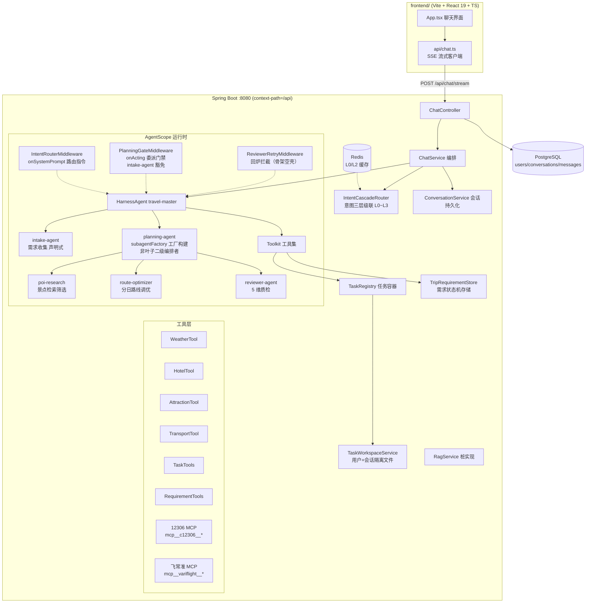

# TravelScope 全模块链路图（含代码实现细节）

> 基于 AgentScope Java 2.0.3 + Spring Boot 3.3.5 + Java 21 + React 19。
> 本文描述每个模块的职责、关键类与代码路径，以及模块间的完整调用链路。
> 2026-09-14 按需求文档 v3 重构为 6 Agent 编排骨架（见第 7 节），工具层原样保留。

## 1. 系统总览



> v3 骨架阶段的状态：6 Agent 编排与需求状态机工具已落地（提示词 + 装配 + 工具骨架）；
> **意图三层级联（L0~L3）已落地（FR-S01，含 Redis L0/L2 缓存与级联埋点日志）**；
> SSE 新事件（clarify_question / agent_status / review_score）、
> Reviewer 回炉拦截、Redis 状态持久化、RAG 双路检索为后续迭代（需求文档 v3 §9.2）。

## 2. 前端模块（`frontend/`）

| 文件 | 职责 |
|---|---|
| `src/api/chat.ts` | 手写 SSE 解析器 + 流式请求 + 会话 CRUD |
| `src/App.tsx` | 聊天 UI：会话侧栏、消息气泡、打字机输出、工具状态条、意图标签 |
| `src/types.ts` | `Conversation / ChatMessage / ChatEvent` 类型定义 |

SSE 流式解析核心（`src/api/chat.ts`）：

```ts
async function* parseSse(res: Response) {
  const reader = res.body!.getReader();
  const decoder = new TextDecoder();
  let buf = "";
  while (true) {
    const { done, value } = await reader.read();
    if (done) break;
    buf += decoder.decode(value, { stream: true });
    const parts = buf.split("\n\n");
    buf = parts.pop()!;                       // 最后一段可能不完整，留到下一轮
    for (const part of parts) {
      const event = /^event:\s*(.+)$/m.exec(part)?.[1];
      const data = /^data:\s?([\s\S]*)$/m.exec(part)?.[1] ?? "";
      if (event) yield { event, data };
    }
  }
}
```

dev 代理（`vite.config.ts`）：`'/api' → http://localhost:8080`，与后端 `server.servlet.context-path: /api` 对齐。

## 3. 接入层：ChatController（`controller/ChatController.java`）

| 端点 | 说明 |
|---|---|
| `POST /chat/stream` | SSE 对话（`SseEmitter`，事件见第 9 节） |
| `GET /chat/conversations` | 会话列表（按更新时间倒序） |
| `POST /chat/conversations` | 新建会话 |
| `GET /chat/conversations/{id}/messages` | 历史消息回显 |

```java
@PostMapping(value = "/stream", produces = MediaType.TEXT_EVENT_STREAM_VALUE)
public SseEmitter stream(@Valid @RequestBody ChatRequest req) {
    Conversation conv = conversationService.resolveConversation(req.conversationId());
    return chatService.streamChat(conv, userId, req.message());
}
```

## 4. 编排层：ChatService（`service/ChatService.java`）

一轮对话的完整编排（`streamChat` 方法）：

```java
public SseEmitter streamChat(Conversation conversation, Long userId, String userMessage) {
    conversationService.saveUserMessage(conversation, userId, userMessage);   // 1. 用户消息入库
    SseEmitter emitter = new SseEmitter(0L);
    StringBuilder replyBuf = new StringBuilder();

    Disposable disposable = Mono
            .fromCallable(() -> resolveIntent(userMessage, userId, conversation.getId()))  // 2. 意图分类（boundedElastic）
            .subscribeOn(Schedulers.boundedElastic())
            .flatMapMany(intent -> Flux.concat(
                    Flux.just(toIntentEvent(intent)),                                // 3. 先推 intent 事件
                    runAgent(conversation, userId, userMessage, intent, replyBuf)))  // 4. 跑主 Agent 事件流
            .subscribe(event -> sendEvent(emitter, event),
                    error -> handleError(emitter, replyBuf, conversation, userId, error),
                    () -> handleComplete(emitter, replyBuf, conversation, userId));  // 5. done 时助手回复入库

    emitter.onTimeout(disposable::dispose);   // 防订阅泄漏
    emitter.onError(t -> disposable.dispose());
    emitter.onCompletion(disposable::dispose);
    return emitter;
}
```

意图路由与上下文注入（`runAgent`）——**用户+会话隔离的关键接线**：

```java
RuntimeContext ctx = RuntimeContext.builder()
        .userId(String.valueOf(userId))
        .sessionId(SESSION_PREFIX + conversation.getId())   // "conv-13"
        .build();
ctx.put(IntentRouterMiddleware.CTX_INTENT_KEY, type.name());
// 协作目录相对路径（tasks/{sessionId}）注入上下文，Middleware 据此给出具体路径
ctx.put(IntentRouterMiddleware.CTX_COLLAB_DIR_KEY,
        taskWorkspaceService.collabDirRelativePath(agentSessionId));

UserMessage msg = new UserMessage(outgoing);
return travelMasterAgent.streamEvents(msg, ctx)          // Reactor 事件流
        .filter(this::isMainAgentEvent)                  // 子代理转发事件（source 含 "/"）不透传
        .mapNotNull(this::toChatEvent);                  // AgentEvent → SSE 事件映射
```

事件映射：`TextBlockDeltaEvent → delta`、`ToolCallStartEvent / ToolResultEndEvent → tool`、`AgentEndEvent → null`（结束在流完成回调统一处理）。

## 5. 意图分类与路由（FR-S01 三层级联，已落地）

**IntentCascadeRouter**（`agent/IntentCascadeRouter.java`）：意图识别的统一入口，
ChatService.resolveIntent 每轮调用。四层级联，**上层命中即短路返回**：

```
用户消息
   │
   ▼
L0 会话延续   短追问（≤20 字符且含代词/语气词/延续词，正则 FOLLOWUP_HINT）
              + Redis 有 30 分钟内该会话最近意图（travelscope:intent:l0:{userId}:{sessionId}）
              → 沿用上次意图，0 计算，命中刷新 TTL
   │ 未命中
   ▼
L1 规则表     保守正则集（打招呼/命令前缀/极固定句式），首个命中即返回，0 模型调用
              （yml travelscope.intent-cascade.l1-rules 可配置，未配置时代码内置同款默认）
              刻意不收编规划类自然语言（「帮我规划杭州三日游」负向回归用例固定守护）
   │ 未命中
   ▼
L2 轻量语义   qwen-turbo 单标签分类（LightweightIntentClassifier，15s 超时）
              + Redis 文本缓存（travelscope:intent:l2:{sha256(msg)}，60 分钟 TTL）
   │ 仍未命中（null/非法标签/超时）
   ▼
L3 LLM 兜底   现有 IntentClassifier（qwen-plus + JSON Schema）原样包装——
              AgentConfig 以方法引用 intentClassifier::classify 注入，零改动
```

关键实现细节：

- **L2 双路径解析**：qwen-turbo 对框架结构化输出（metadata `_structured_output` 键）
  遵循度不稳定，实测常把标签（如 `CHAT`）直接当纯文本输出——LightweightIntentClassifier
  先走结构化解析，异常/为空再走纯文本标签归一化（去引号句读后 valueOf），
  双路皆失败才返回 null 落 L3
- **Redis 降级**：RedisIntentCache 每个操作 try/catch 全异常（首次 warn 后续 debug），
  Router 侧另有 safe* 防御包装——缓存彻底不可用时级联自动退化为 L1 → L2 → L3，不阻断对话
- **每层命中写回 L0**：任何一层成功都刷新该会话最近意图（TTL 滚动），支撑后续追问走 L0
- **埋点日志**（FR-S12 基础）：`cascade_hit=L0|L1|L2|L2_CACHE|L3 latency={x}ms intent={} userId={} sessionId={}`，
  全层未命中输出 `cascade_miss`
- **配置**（`travelscope.intent-cascade.*`）：`enabled`（false 直通 L3 保持旧行为）、
  `l0-enabled / l0-ttl-minutes / l0-max-message-length`、`l2-enabled / l2-model /
  l2-cache-enabled / l2-cache-ttl-minutes`、`l1-rules`（List，仓库首个 List 配置）
- **Bean 装配**（AgentConfig）：`dashscopeChatModel`（qwen-plus，@Primary）+
  `dashscopeTurboModel`（qwen-turbo，L2 专用）+ `intentCascadeRouter`（L2=turbo 包装、
  L3=intentClassifier 方法引用）

实测数据（真实 API，验收标准对照）：「你好」/「/天气 北京」L1 命中 0ms 且零模型调用；
「帮我规划杭州三日游」L2 命中 270ms 判 PLANNING；同会话追问「那改成四天呢」L0 命中 0ms。
测试：`IntentCascadeRouterTest`（16 用例含 a~e 全映射）、`LightweightIntentClassifierTest`
与 `IntentCascadeRealApiTest`（API_KEY 门控）、`RedisIntentCacheTest`（6379 端口门控）。

**IntentRouterMiddleware**（`agent/IntentRouterMiddleware.java`）：`onSystemPrompt` 阶段按意图追加路由指令。
PLANNING 指令会注入本轮会话的具体协作路径（来自 `CTX_COLLAB_DIR_KEY`）：

```
【本轮路由指令】系统已判定本轮为完整行程规划意图。本轮会话: conv-13, 协作目录: tasks/conv-13（相对工作区根）。

委派流程（系统在代码层强制校验，跳步会被拦截）：
1. 委派 intake-agent 收口需求：任务说明中带上本轮用户消息与协作目录 tasks/conv-13。
   - intake-agent 返回反问 → 原样转达给用户，本轮结束
   - intake-agent 返回「信息已收齐」→ 读取 tasks/conv-13/intake_done.md，继续第 2 步
2. 按需求拆分任务（每项含 taskId/描述/建议工具/优先级）
3. 调用 create_task_backlog 工具登记清单：sessionId 填 "conv-13", tasksJson 填任务 JSON 数组…
4. 登记成功后调用 agent_spawn 委派 planning-agent，任务说明中必须写明：
   「用 read_file 读取 tasks/conv-13/task_backlog.md 与 intake_done.md 执行；每完成一项任务调用 update_task_status 回报」
5. 需要时调用 get_task_progress 查询未完成任务数…完成后整合 execution_result.md、itinerary_draft.md 与 review_passed.md 输出
```

## 6. 任务容器与需求状态机（需求 1 + 2 核心）

### 6.1 TaskRegistry（`service/TaskRegistry.java`）

内存容器 + MD 文件双份存储，按 `userId:sessionId` 双键隔离：

```java
public String createBacklog(String userId, String sessionId, String tasksJson) {
    List<PlanningTask> parsed = parseTasks(tasksJson);          // fastjson2 解析 JSON 数组
    if (parsed.isEmpty()) return "ERROR: tasksJson 无法解析…";   // 代码层校验
    String md = renderBacklogMd(sessionId, parsed);
    Path file = taskWorkspaceService.writeTaskBacklog(userId, sessionId, md);  // 落盘（隔离路径）
    containers.put(containerKey(userId, sessionId),
            new SessionTaskContainer(userId, sessionId, file, parsed));        // 注册内存队列
    return "任务清单已登记：共 N 项…现在可以调用 agent_spawn 委派 planning-agent…";
}
```

- `progress(userId, sessionId)` → 「共 N 项：已完成 x，进行中 y，待处理 z，失败 f。未完成任务: T2(PENDING)…」
- `updateStatus(userId, sessionId, taskId, status)` → 状态机 PENDING/IN_PROGRESS/DONE/FAILED，同时追加写 MD 文件
- `hasBacklog(userId, sessionId)` → 委派门禁校验用

### 6.2 TaskTools（`agent/tools/TaskTools.java`）

注册进 Toolkit，主/子 Agent 都能调用的 3 个业务工具 + 1 个门禁提示工具：

```java
@Tool(description = "登记行程规划任务清单到任务容器…")
public String create_task_backlog(
        @ToolParam(name = "sessionId", description = "本轮会话 ID…") String sessionId,
        @ToolParam(name = "tasksJson", description = "任务清单 JSON 数组字符串…") String tasksJson,
        RuntimeContext ctx) {                       // 不带 @ToolParam 的参数 = Toolkit 自动注入上下文
    return taskRegistry.createBacklog(ctx.getUserId(), sessionId, tasksJson);
}
```

> 上下文注入机制：`ToolMethodInvoker.convertParameters` 对**未标注 @ToolParam 且类型为 RuntimeContext**
> 的参数直接传入当前调用的 RuntimeContext——userId 因此不依赖 ThreadLocal，子代理调用时自然带自己的上下文。

### 6.3 PlanningGateMiddleware（`agent/PlanningGateMiddleware.java`）

**代码层强制「先登记清单、再委派」**——在 `onActing` 阶段拦截并重写工具调用。
v3 起增加 **intake-agent 豁免**：需求收集发生在任务登记之前（需求文档 4.2 步骤 [5]/[6]），
`agent_id=intake-agent` 的 spawn 不受门禁约束：

```java
// 读意图：RuntimeContext.get(String) 签名是 <T> T get(String)，必须直接以 String 接收。
// 勿写 String.valueOf(ctx.get(...))——泛型目标类型推断会把 <T> 定为 char[]，
// 绑定 String.valueOf(char[]) 重载，运行时 String→char[] 强转抛 ClassCastException
// （2026-09-16 真实规划请求触发过，详见 fix-record 7.6 节）
String intent = ctx.get(IntentRouterMiddleware.CTX_INTENT_KEY);

public Flux<AgentEvent> onActing(Agent agent, RuntimeContext ctx, ActingInput input,
                                 Function<ActingInput, Flux<AgentEvent>> next) {
    // 仅 PLANNING 意图 + 出现 agent_spawn 时介入
    if (spawns.isEmpty() || !"PLANNING".equals(intent)) return next.apply(input);

    // intake-agent 豁免：需求收集是任务登记的前置步骤，不受门禁约束
    boolean hasGatedSpawn = spawns.stream()
            .anyMatch(t -> !IntakeAgent.AGENT_NAME.equals(agentIdOf(t)));   // 读 spawn 参数 agent_id
    if (!hasGatedSpawn) return next.apply(input);

    if (taskRegistry.hasBacklog(userId, sessionId)) return next.apply(input);  // 已登记 → 放行

    // 未登记 → 把受门禁约束的 agent_spawn 调用【替换】为 planning_gate_hint（真实工具，返回纠正指令）
    // （intake-agent 的 spawn 即使与受门禁的 spawn 同轮出现也原样保留）
    List<ToolUseBlock> rewritten = new ArrayList<>();
    for (ToolUseBlock call : input.toolCalls()) {
        rewritten.add("agent_spawn".equals(call.getName()) && !IntakeAgent.AGENT_NAME.equals(agentIdOf(call))
                ? new ToolUseBlock(call.getId(), GATE_HINT_TOOL, Map.of("reason", hint))
                : call);
    }
    return next.apply(new ActingInput(rewritten));   // 受门禁的 agent_spawn 根本不会执行
}
```

`order() = -1000`：`MiddlewareChain.build` 按列表顺序嵌套、第一个为最外层，harness 的
`SubagentsMiddleware`（order=1，直接执行 agent_spawn）必须排在其后，拦截才生效。

### 6.4 需求状态机（v3 FR-S02：intake-agent 的代码工具）

「判断缺什么」是纯确定性逻辑，下沉为代码工具（`agent/tools/RequirementTools.java`），
「怎么问、怎么听」由 intake-agent 的语言能力承载：

```java
@Tool(description = "查询当前会话行程需求的收集状态：已收集哪些字段、还缺哪些必填项…")
public String get_missing_fields(@ToolParam(name = "sessionId") String sessionId, RuntimeContext ctx) {
    return store.get(ctx.getUserId(), sessionId).summary();      // missingFields() 纯字段判空，零模型调用
}

@Tool(description = "把本轮理解到的需求字段写回状态机。fieldsJson 形如 {\"destination\":\"北京\",…}")
public String update_requirement_state(@ToolParam(name = "sessionId") String sessionId,
        @ToolParam(name = "fieldsJson") String fieldsJson, RuntimeContext ctx) { … }
```

- `dto/TripRequirementState`：8 字段（必填 destination/days/startDate/fromCity + 选填
  budget/preference/people/special）+ 状态枚举 COLLECTING/DONE/DEGRADED + 反问轮次计数
- `service/TripRequirementStore`：`userId:sessionId` 双键隔离存储（对齐 TaskRegistry 模式）；
  TODO 迁移 Redis hash `trip:req:{userId}:{sessionId}`（FR-S02）

## 7. Agent 层（`config/AgentConfig.java` + `agent/`）

v3 编排为 6 Agent：master 收口 → intake 收需求 → Planner 直调工具 + 并行调度 → Reviewer 质检。
**关键框架事实**（agentscope-harness 2.0.3 字节码核验）：声明式 `SubagentDeclaration` 注册的
子 Agent 被框架强制 `asLeafSubagent()`——toolkit 无 `agent_spawn`，不能再委派。因此：

- **intake-agent** 走声明式（叶子即可）：`.subagent(intakeSubAgent)`，tools 白名单限定状态机工具
- **planning-agent** 走 **`subagentFactory(name, description, factory)` 公开 API**：工厂内用
  `HarnessAgent.builder()` 手工构建（非叶子），build 时自动安装 SubagentsMiddleware，
  能 spawn 自己声明的 3 个子 Agent；spawn 深度 master(0)→planner(1)→子(2) ≤ 框架上限 3

```java
// intake-agent：声明式叶子，tools 白名单限定需求状态机工具
SubagentDeclaration intakeSubAgent = SubagentDeclaration.builder()
        .name(IntakeAgent.AGENT_NAME)
        .description("需求收集 Agent（接待员）…")
        .inlineAgentsBody(IntakeAgent.SYS_PROMPT)
        .model(appProperties.getDashscope().getModel())
        .maxIters(IntakeAgent.MAX_ITERS)               // 6
        .workspaceMode(WorkspaceMode.SHARED)
        .tools(List.of("get_missing_fields", "update_requirement_state"))
        .build();

HarnessAgent agent = HarnessAgent.builder()
        .name("travel-master").sysPrompt(TravelMasterAgent.SYS_PROMPT)
        .model(dashscopeChatModel).modelResolver(name -> dashscopeChatModel)
        .toolkit(toolkit).maxIters(15)
        .middlewares(List.of(new IntentRouterMiddleware(),
                new PlanningGateMiddleware(taskRegistry),
                new ReviewerRetryMiddleware()))         // v3 骨架空壳透传，order=-900
        .permissionContext(PermissionContextState.builder().mode(PermissionMode.BYPASS).build())
        .workspace(".agentscope/workspace")
        .skillRepository(new ClasspathSkillRepository("skills"))
        .stateStore(new InMemoryAgentStateStore())
        .subagent(intakeSubAgent)
        // planning-agent：工厂手工构建非叶子二级编排者
        .subagentFactory(ItineraryAgent.AGENT_NAME, "规划 Agent（二级编排者）…",
                name -> buildPlannerAgent(toolkit, dashscopeChatModel))
        .build();
```

`buildPlannerAgent(toolkit, model)`（同文件私有方法）内部——三个声明均 SHARED 工作区，
poi-research 限定 attraction-search 技能：

```java
SubagentDeclaration poiResearch = SubagentDeclaration.builder()
        .name("poi-research").inlineAgentsBody(PoiResearchAgent.SYS_PROMPT)
        .maxIters(6).workspaceMode(WorkspaceMode.SHARED)
        .skills(List.of("attraction-search")).build();
SubagentDeclaration routeOptimizer = …("route-optimizer", maxIters=6, SHARED)…;
SubagentDeclaration reviewer       = …("reviewer-agent",  maxIters=6, SHARED)…;

return HarnessAgent.builder()
        .name("planning-agent").sysPrompt(ItineraryAgent.SYS_PROMPT)
        .model(dashscopeChatModel).modelResolver(name -> dashscopeChatModel)
        .toolkit(toolkit).maxIters(12)                  // v3: 8 → 12（直调+spawn+组装+送审链路长）
        .permissionContext(…BYPASS…).workspace(".agentscope/workspace")
        .skillRepository(new ClasspathSkillRepository("skills"))
        .stateStore(new InMemoryAgentStateStore())
        .subagents(List.of(poiResearch, routeOptimizer, reviewer))
        .build();
```

> 工厂细节：`subagentFactory` 的 `Function<String,Agent>` 每次 spawn 调用时 build 新实例
> （与 IntentClassifier 每次新建 ReActAgent 同款模式）；传入共享 toolkit 引用是安全的——
> `HarnessAgent.build()` 内部对 toolkit 做 copy（浅拷贝共享工具实例），不污染 travelToolkit Bean，
> MCP npx 进程不会重复拉起。`ClasspathSkillRepository` 构造抛 IOException，工厂内捕获转为
> 非受检异常（Function 不允许抛受检异常）。

提示词结构（6 个常量类中的 `SYS_PROMPT` text block，格式一致）：

- `TravelMasterAgent`：IMPORTANT 硬约束 → 能力与路由（For X, use Y + 不得委派反向清单）→
  简单请求流程 → 规划流程（**委派 intake 收口 → create_task_backlog 登记 → agent_spawn 委派
  Planner → 整合 review_passed.md**）→ 任务容器协作机制 → 输出风格
- `IntakeAgent`：工作流程（理解→update 写回→查缺项→二选一收尾）→ 反问策略（选择题/默认值/
  ≤3 轮 DEGRADED）→ 工具 → intake_done.md 格式 → 约束（状态机是唯一事实源）
- `ItineraryAgent`（v3 Planner）：Scope（直调工具 + 只委派 poi/route）→ 输入（backlog +
  intake_done）→ 执行流程（①直调工具 ②同回合并行 spawn ③组装 + POI 坐标核验 ④spawn reviewer
  送审，不通过回炉 ≤2 次）→ 执行规范 → 汇报格式
- `PoiResearchAgent`：多轮换词重查 → poi_shortlist.md（RAG 双路 TODO 待 FR-S11）
- `RouteOptimizerAgent`：两两算通勤 → 就近聚类分日 → 迭代调整 → route_plan.md
- `ReviewerAgent`：5 维评分（各 20 分，总分 ≥80 且无单维 <12 通过）→ 可调工具核验事实 →
  review_passed.md / review_report.md

## 8. 工作区与隔离结构（需求 1）

```
.agentscope/workspace/                     ← harness workspace 根
└── {userId}/                              ← harness 按 RuntimeContext.userId 自动隔离（用户级）
    ├── MEMORY.md / memory/                ← Agent 长期记忆（每用户独立）
    ├── tasks/
    │   └── {sessionId}/                   ← 会话协作目录（会话级）
    │       ├── intake_done.md             ← intake-agent 写入的需求收集结果（v3 新增）
    │       ├── task_backlog.md            ← create_task_backlog 落盘的任务清单
    │       ├── poi_shortlist.md           ← poi-research 产出的景点候选清单（v3 新增）
    │       ├── route_plan.md              ← route-optimizer 产出的分日路线方案（v3 新增）
    │       ├── execution_result.md        ← 规划 Agent 写回的执行结果
    │       ├── itinerary_draft.md         ← 规划 Agent 生成的行程草案
    │       ├── review_report.md           ← reviewer-agent 不通过时的质检报告（v3 新增）
    │       ├── review_passed.md           ← reviewer-agent 通过时的凭证（v3 新增）
    │       └── session_meta.md            ← 会话元信息（参与者：6 Agent）
    ├── agents/travel-master/ …            ← harness 管理的主 Agent 会话数据
    └── default/ …
```

- **用户隔离**：harness 的文件工具（write_file/read_file/list_files）把相对路径解析到
  `{workspace}/{userId}/` 之下（由 `WorkspaceManager.resolveRuntimeDataPath` 实现），主 Agent 与
  `WorkspaceMode.SHARED` 的子代理同根，天然同用户隔离
- **会话隔离**：协作文件收敛到 `tasks/{sessionId}/` 子目录，具体路径由代码（ChatService →
  RuntimeContext → Middleware 指令）注入给 Agent，不依赖模型记忆

## 9. SSE 事件协议

| 事件 | payload | 时机 |
|---|---|---|
| `intent` | `{"intent":"PLANNING","reason":"…"}` | 意图分类完成后（每轮第一个事件） |
| `delta` | 文本增量 | 主 Agent 流式输出 |
| `tool` | 工具名 / `工具名:SUCCESS` | 工具调用开始/结束（含 write_file、agent_spawn、create_task_backlog 等） |
| `done` | 完整回复文本 | 事件流完成（助手回复已持久化） |
| `error` | 错误消息 | Agent 执行异常 |

## 10. 工具层

| 工具 | 实现 | 数据源 |
|---|---|---|
| `getWeather` / `getWeatherForecast` | `WeatherTool`（@Tool 注解） | 和风天气 API |
| `searchHotels` / `searchNearbyPois` | `HotelTool` | 高德 POI |
| `searchAttractions` / `searchNearbyAttractions` | `AttractionTool` | 高德 POI |
| `geocode` / `getDrivingRoute` / `getTransitRoute` | `TransportTool` | 高德路径规划 |
| `create_task_backlog` / `get_task_progress` / `update_task_status` / `planning_gate_hint` | `TaskTools` → `TaskRegistry` | 内存容器 + 工作区 MD |
| `get_missing_fields` / `update_requirement_state` | `RequirementTools` → `TripRequirementStore`（v3 新增） | 内存状态机（TODO Redis） |
| `mcp__c12306__get-tickets` 等 | 12306 MCP（stdio，`npx -y 12306-mcp`，免鉴权） | 12306 实时余票 |
| `mcp__variflight__searchFlightsByDepArr` 等 | 飞常准 MCP（需 `VARIFLIGHT_API_KEY`） | 实时机票票价 |
| `agent_spawn` / `write_file` / `read_file` 等 | harness 内置（SubagentsMiddleware / 文件系统） | AgentScope harness |

MCP 注册（`AgentConfig.registerMcpClients`）：Windows 下经 `cmd /c npx …` 拉起子进程，
`McpClientBuilder.create("c12306").stdioTransport(...).buildSync()`，60 秒超时，失败仅告警不阻断启动。
工具细节以 `src/main/resources/skills/` 下 5 个 SKILL.md 为唯一事实源。

## 11. 持久化层

- `entity/`：`User`（匿名 guest，启动时 getOrCreate）、`Conversation`（conversations 表）、
  `Message`（messages 表，JSONB 列暂不映射）
- `repository/`：Spring Data JPA（`findByUserIdAndStatusOrderByUpdatedAtDesc` 等）
- `schema.sql`：建表脚本（JPA `ddl-auto: none`）；助手回复在 Agent 事件流完成回调中入库
- `common/GlobalExceptionHandler`：统一 `{code, message}` 错误响应

## 12. RAG 预留（`service/RagService.java` + `RagServiceStub`）

接口 `isAvailable()`（当前 false）+ `retrieve(query, topK)`（空列表）。
ChatService 在 intent=RAG 且可用时把检索片段拼入消息（`augmentWithRag`）；
schema 中 `documents` / `document_chunks`（pgvector vector(1024) + HNSW）已就绪，
后续接 `agentscope-extensions-rag-simple` 的 SimpleKnowledge + PgVectorStore 零改造。
