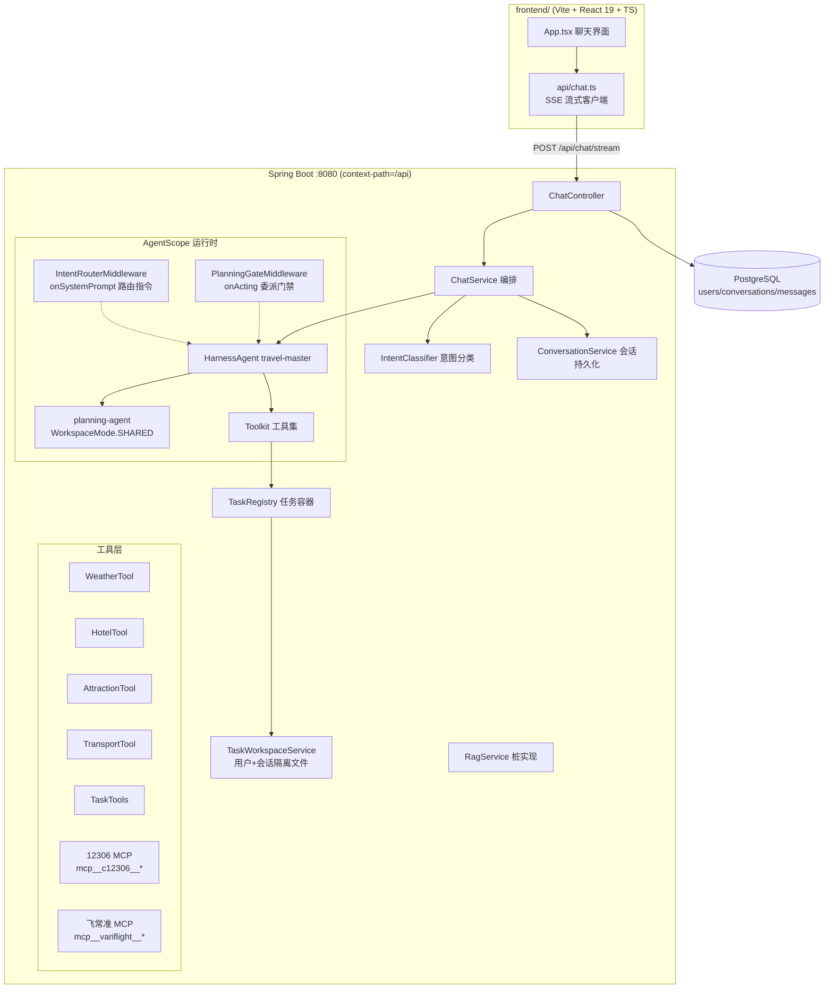

# TravelScope 全模块链路图（含代码实现细节）

> 基于 AgentScope Java 2.0.3 + Spring Boot 3.3.5 + Java 21 + React 19。
> 本文描述每个模块的职责、关键类与代码路径，以及模块间的完整调用链路。

## 1. 系统总览



## 2. 前端模块（`frontend/`）

| 文件 | 职责 |
|---|---|
| `src/api/chat.ts` | 手写 SSE 解析器 + 流式请求 + 会话 CRUD |
| `src/App.tsx` | 聊天 UI：会话侧栏、消息气泡、打字机输出、工具状态条、意图标签 |
| `src/types.ts` | `Conversation / ChatMessage / ChatEvent` 类型定义 |

SSE 流式解析核心（`src/api/chat.ts`）：

```ts
async function* parseSse(res: Response) {
  const reader = res.body!.getReader();
  const decoder = new TextDecoder();
  let buf = "";
  while (true) {
    const { done, value } = await reader.read();
    if (done) break;
    buf += decoder.decode(value, { stream: true });
    const parts = buf.split("\n\n");
    buf = parts.pop()!;                       // 最后一段可能不完整，留到下一轮
    for (const part of parts) {
      const event = /^event:\s*(.+)$/m.exec(part)?.[1];
      const data = /^data:\s?([\s\S]*)$/m.exec(part)?.[1] ?? "";
      if (event) yield { event, data };
    }
  }
}
```

dev 代理（`vite.config.ts`）：`'/api' → http://localhost:8080`，与后端 `server.servlet.context-path: /api` 对齐。

## 3. 接入层：ChatController（`controller/ChatController.java`）

| 端点 | 说明 |
|---|---|
| `POST /chat/stream` | SSE 对话（`SseEmitter`，事件见第 9 节） |
| `GET /chat/conversations` | 会话列表（按更新时间倒序） |
| `POST /chat/conversations` | 新建会话 |
| `GET /chat/conversations/{id}/messages` | 历史消息回显 |

```java
@PostMapping(value = "/stream", produces = MediaType.TEXT_EVENT_STREAM_VALUE)
public SseEmitter stream(@Valid @RequestBody ChatRequest req) {
    Conversation conv = conversationService.resolveConversation(req.conversationId());
    return chatService.streamChat(conv, userId, req.message());
}
```

## 4. 编排层：ChatService（`service/ChatService.java`）

一轮对话的完整编排（`streamChat` 方法）：

```java
public SseEmitter streamChat(Conversation conversation, Long userId, String userMessage) {
    conversationService.saveUserMessage(conversation, userId, userMessage);   // 1. 用户消息入库
    SseEmitter emitter = new SseEmitter(0L);
    StringBuilder replyBuf = new StringBuilder();

    Disposable disposable = Mono
            .fromCallable(() -> resolveIntent(userMessage, userId, conversation.getId()))  // 2. 意图分类（boundedElastic）
            .subscribeOn(Schedulers.boundedElastic())
            .flatMapMany(intent -> Flux.concat(
                    Flux.just(toIntentEvent(intent)),                                // 3. 先推 intent 事件
                    runAgent(conversation, userId, userMessage, intent, replyBuf)))  // 4. 跑主 Agent 事件流
            .subscribe(event -> sendEvent(emitter, event),
                    error -> handleError(emitter, replyBuf, conversation, userId, error),
                    () -> handleComplete(emitter, replyBuf, conversation, userId));  // 5. done 时助手回复入库

    emitter.onTimeout(disposable::dispose);   // 防订阅泄漏
    emitter.onError(t -> disposable.dispose());
    emitter.onCompletion(disposable::dispose);
    return emitter;
}
```

意图路由与上下文注入（`runAgent`）——**用户+会话隔离的关键接线**：

```java
RuntimeContext ctx = RuntimeContext.builder()
        .userId(String.valueOf(userId))
        .sessionId(SESSION_PREFIX + conversation.getId())   // "conv-13"
        .build();
ctx.put(IntentRouterMiddleware.CTX_INTENT_KEY, type.name());
// 协作目录相对路径（tasks/{sessionId}）注入上下文，Middleware 据此给出具体路径
ctx.put(IntentRouterMiddleware.CTX_COLLAB_DIR_KEY,
        taskWorkspaceService.collabDirRelativePath(agentSessionId));

UserMessage msg = new UserMessage(outgoing);
return travelMasterAgent.streamEvents(msg, ctx)          // Reactor 事件流
        .filter(this::isMainAgentEvent)                  // 子代理转发事件（source 含 "/"）不透传
        .mapNotNull(this::toChatEvent);                  // AgentEvent → SSE 事件映射
```

事件映射：`TextBlockDeltaEvent → delta`、`ToolCallStartEvent / ToolResultEndEvent → tool`、`AgentEndEvent → null`（结束在流完成回调统一处理）。

## 5. 意图分类与路由

**IntentClassifier**（`agent/IntentClassifier.java`）：轻量 ReActAgent（maxIters=2、无工具），
结构化输出分类：

```java
ReActAgent classifier = ReActAgent.builder()
        .name("intent-classifier").sysPrompt(SYS_PROMPT).model(model).maxIters(2).build();
Msg reply = classifier.call(userMessage, IntentResult.class, ctx).block(CLASSIFY_TIMEOUT);
IntentResult result = reply.getStructuredData(IntentResult.class);   // {intent, reason}
```

每次分类新建实例（ReActAgent 非线程安全），Model 共享。分类失败返回 null → 主 Agent 按提示词自主路由。

**IntentRouterMiddleware**（`agent/IntentRouterMiddleware.java`）：`onSystemPrompt` 阶段按意图追加路由指令。
PLANNING 指令会注入本轮会话的具体协作路径（来自 `CTX_COLLAB_DIR_KEY`）：

```
【本轮路由指令】系统已判定本轮为完整行程规划意图。本轮会话: conv-13, 协作目录: tasks/conv-13（相对工作区根）。
委派流程（系统在代码层强制校验，跳步会被拦截）：
1. 按你的规划流程拆分任务（每项含 taskId/描述/建议工具/优先级）
2. 调用 create_task_backlog 工具登记清单：sessionId 填 "conv-13", tasksJson 填任务 JSON 数组…
3. 登记成功后调用 agent_spawn 委派 planning-agent，任务说明中必须写明：
   「用 read_file 读取 tasks/conv-13/task_backlog.md 执行；每完成一项任务调用 update_task_status 回报」
4. 需要时调用 get_task_progress 查询未完成任务数…
```

## 6. 任务容器（需求 1 + 2 核心）

### 6.1 TaskRegistry（`service/TaskRegistry.java`）

内存容器 + MD 文件双份存储，按 `userId:sessionId` 双键隔离：

```java
public String createBacklog(String userId, String sessionId, String tasksJson) {
    List<PlanningTask> parsed = parseTasks(tasksJson);          // fastjson2 解析 JSON 数组
    if (parsed.isEmpty()) return "ERROR: tasksJson 无法解析…";   // 代码层校验
    String md = renderBacklogMd(sessionId, parsed);
    Path file = taskWorkspaceService.writeTaskBacklog(userId, sessionId, md);  // 落盘（隔离路径）
    containers.put(containerKey(userId, sessionId),
            new SessionTaskContainer(userId, sessionId, file, parsed));        // 注册内存队列
    return "任务清单已登记：共 N 项…现在可以调用 agent_spawn 委派 planning-agent…";
}
```

- `progress(userId, sessionId)` → 「共 N 项：已完成 x，进行中 y，待处理 z，失败 f。未完成任务: T2(PENDING)…」
- `updateStatus(userId, sessionId, taskId, status)` → 状态机 PENDING/IN_PROGRESS/DONE/FAILED，同时追加写 MD 文件
- `hasBacklog(userId, sessionId)` → 委派门禁校验用

### 6.2 TaskTools（`agent/tools/TaskTools.java`）

注册进 Toolkit，主/子 Agent 都能调用的 3 个业务工具 + 1 个门禁提示工具：

```java
@Tool(description = "登记行程规划任务清单到任务容器…")
public String create_task_backlog(
        @ToolParam(name = "sessionId", description = "本轮会话 ID…") String sessionId,
        @ToolParam(name = "tasksJson", description = "任务清单 JSON 数组字符串…") String tasksJson,
        RuntimeContext ctx) {                       // 不带 @ToolParam 的参数 = Toolkit 自动注入上下文
    return taskRegistry.createBacklog(ctx.getUserId(), sessionId, tasksJson);
}
```

> 上下文注入机制：`ToolMethodInvoker.convertParameters` 对**未标注 @ToolParam 且类型为 RuntimeContext**
> 的参数直接传入当前调用的 RuntimeContext——userId 因此不依赖 ThreadLocal，子代理调用时自然带自己的上下文。

### 6.3 PlanningGateMiddleware（`agent/PlanningGateMiddleware.java`）

**代码层强制「先登记清单、再委派」**——在 `onActing` 阶段拦截并重写工具调用：

```java
public Flux<AgentEvent> onActing(Agent agent, RuntimeContext ctx, ActingInput input,
                                 Function<ActingInput, Flux<AgentEvent>> next) {
    // 仅 PLANNING 意图 + 出现 agent_spawn 时介入
    if (!hasSpawn || !"PLANNING".equals(intent)) return next.apply(input);

    if (taskRegistry.hasBacklog(userId, sessionId)) return next.apply(input);  // 已登记 → 放行

    // 未登记 → 把 agent_spawn 调用【替换】为 planning_gate_hint（真实工具，返回纠正指令）
    List<ToolUseBlock> rewritten = new ArrayList<>();
    for (ToolUseBlock call : input.toolCalls()) {
        rewritten.add("agent_spawn".equals(call.getName())
                ? new ToolUseBlock(call.getId(), GATE_HINT_TOOL, Map.of("reason", hint))
                : call);
    }
    return next.apply(new ActingInput(rewritten));   // agent_spawn 根本不会执行
}
```

`order() = -1000`：`MiddlewareChain.build` 按列表顺序嵌套、第一个为最外层，harness 的
`SubagentsMiddleware`（order=1，直接执行 agent_spawn）必须排在其后，拦截才生效。

## 7. Agent 层（`config/AgentConfig.java` + `agent/`）

主 Agent 组装（HarnessAgent = ReActAgent + 工程能力叠加）：

```java
SubagentDeclaration planningSubAgent = SubagentDeclaration.builder()
        .name("planning-agent")
        .inlineAgentsBody(ItineraryAgent.SYS_PROMPT)
        .model("qwen-plus").maxIters(8)
        .skills(List.of("weather-query", "hotel-search", "attraction-search",
                        "train-ticket-query", "flight-ticket-query"))
        .workspaceMode(WorkspaceMode.SHARED)     // 与主 Agent 共享工作区（关键修复）
        .build();

HarnessAgent agent = HarnessAgent.builder()
        .name("travel-master").sysPrompt(TravelMasterAgent.SYS_PROMPT)
        .model(dashscopeChatModel).modelResolver(name -> dashscopeChatModel)
        .toolkit(toolkit).maxIters(15)
        .middlewares(List.of(new IntentRouterMiddleware(), new PlanningGateMiddleware(taskRegistry)))
        .permissionContext(PermissionContextState.builder().mode(PermissionMode.BYPASS).build())
        .workspace(".agentscope/workspace")
        .skillRepository(new ClasspathSkillRepository("skills"))
        .stateStore(new InMemoryAgentStateStore())
        .subagent(planningSubAgent)
        .build();
```

提示词结构（两个类中的 `SYS_PROMPT` text block）：

- `TravelMasterAgent`：IMPORTANT 硬约束 → 能力与路由（For X, use Y + 不得委派反向清单）→ 简单请求流程 →
  规划流程（create_task_backlog 登记 → agent_spawn 委派 → get_task_progress 查进度）→ 任务容器协作机制 → 输出风格
- `ItineraryAgent`：worker 身份锚定 → Scope → 协作机制（按委派说明路径读 backlog、update_task_status 回报、
  缺失即 fail-fast）→ 可用工具概览（细节以 skills 为唯一事实源）→ 执行规范 → 草案格式 → 汇报格式

## 8. 工作区与隔离结构（需求 1）

```
.agentscope/workspace/                     ← harness workspace 根
└── {userId}/                              ← harness 按 RuntimeContext.userId 自动隔离（用户级）
    ├── MEMORY.md / memory/                ← Agent 长期记忆（每用户独立）
    ├── tasks/
    │   └── {sessionId}/                   ← 会话协作目录（会话级，本次新增）
    │       ├── task_backlog.md            ← create_task_backlog 落盘的任务清单
    │       ├── execution_result.md        ← 子 Agent 写回的执行结果
    │       ├── itinerary_draft.md         ← 子 Agent 生成的行程草案
    │       └── session_meta.md            ← 会话元信息
    ├── agents/travel-master/ …            ← harness 管理的主 Agent 会话数据
    └── default/ …
```

- **用户隔离**：harness 的文件工具（write_file/read_file/list_files）把相对路径解析到
  `{workspace}/{userId}/` 之下（由 `WorkspaceManager.resolveRuntimeDataPath` 实现），主 Agent 与
  `WorkspaceMode.SHARED` 的子代理同根，天然同用户隔离
- **会话隔离**：协作文件收敛到 `tasks/{sessionId}/` 子目录，具体路径由代码（ChatService →
  RuntimeContext → Middleware 指令）注入给 Agent，不依赖模型记忆

## 9. SSE 事件协议

| 事件 | payload | 时机 |
|---|---|---|
| `intent` | `{"intent":"PLANNING","reason":"…"}` | 意图分类完成后（每轮第一个事件） |
| `delta` | 文本增量 | 主 Agent 流式输出 |
| `tool` | 工具名 / `工具名:SUCCESS` | 工具调用开始/结束（含 write_file、agent_spawn、create_task_backlog 等） |
| `done` | 完整回复文本 | 事件流完成（助手回复已持久化） |
| `error` | 错误消息 | Agent 执行异常 |

## 10. 工具层

| 工具 | 实现 | 数据源 |
|---|---|---|
| `getWeather` / `getWeatherForecast` | `WeatherTool`（@Tool 注解） | 和风天气 API |
| `searchHotels` / `searchNearbyPois` | `HotelTool` | 高德 POI |
| `searchAttractions` / `searchNearbyAttractions` | `AttractionTool` | 高德 POI |
| `geocode` / `getDrivingRoute` / `getTransitRoute` | `TransportTool` | 高德路径规划 |
| `create_task_backlog` / `get_task_progress` / `update_task_status` / `planning_gate_hint` | `TaskTools` → `TaskRegistry` | 内存容器 + 工作区 MD |
| `mcp__c12306__get-tickets` 等 | 12306 MCP（stdio，`npx -y 12306-mcp`，免鉴权） | 12306 实时余票 |
| `mcp__variflight__searchFlightsByDepArr` 等 | 飞常准 MCP（需 `VARIFLIGHT_API_KEY`） | 实时机票票价 |
| `agent_spawn` / `write_file` / `read_file` 等 | harness 内置（SubagentsMiddleware / 文件系统） | AgentScope harness |

MCP 注册（`AgentConfig.registerMcpClients`）：Windows 下经 `cmd /c npx …` 拉起子进程，
`McpClientBuilder.create("c12306").stdioTransport(...).buildSync()`，60 秒超时，失败仅告警不阻断启动。
工具细节以 `src/main/resources/skills/` 下 5 个 SKILL.md 为唯一事实源。

## 11. 持久化层

- `entity/`：`User`（匿名 guest，启动时 getOrCreate）、`Conversation`（conversations 表）、
  `Message`（messages 表，JSONB 列暂不映射）
- `repository/`：Spring Data JPA（`findByUserIdAndStatusOrderByUpdatedAtDesc` 等）
- `schema.sql`：建表脚本（JPA `ddl-auto: none`）；助手回复在 Agent 事件流完成回调中入库
- `common/GlobalExceptionHandler`：统一 `{code, message}` 错误响应

## 12. RAG 预留（`service/RagService.java` + `RagServiceStub`）

接口 `isAvailable()`（当前 false）+ `retrieve(query, topK)`（空列表）。
ChatService 在 intent=RAG 且可用时把检索片段拼入消息（`augmentWithRag`）；
schema 中 `documents` / `document_chunks`（pgvector vector(1024) + HNSW）已就绪，
后续接 `agentscope-extensions-rag-simple` 的 SimpleKnowledge + PgVectorStore 零改造。
